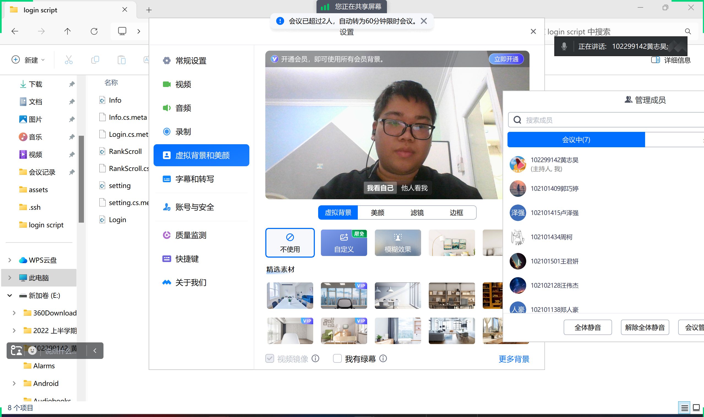
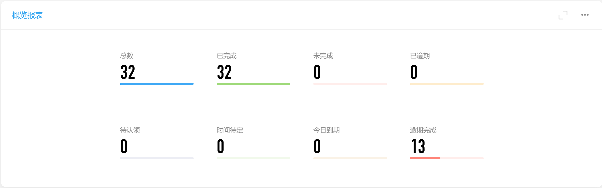
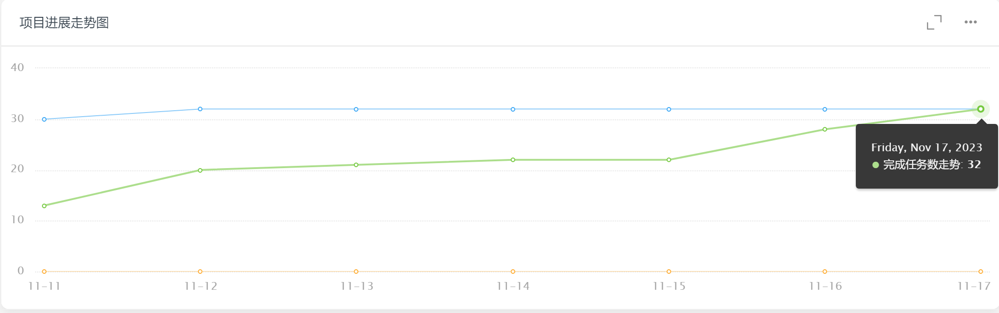
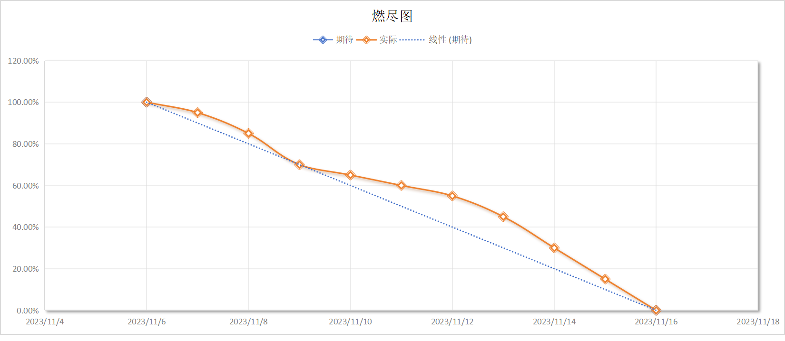
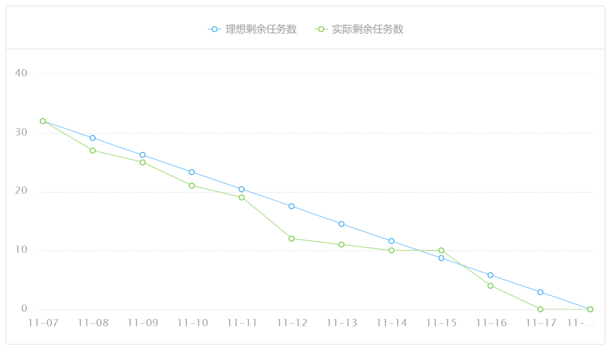

| 这个作业属于哪个课程 | [课程的链接](https://bbs.csdn.net/forums/fzusdn-0831?typeId=4994744) |
| -------------------- | ------------------------------------------------------------ |
| 这个作业要求在哪里   | [2023秋软工实践团队作业——alpha冲刺-CSDN社区](https://bbs.csdn.net/topics/617519084) |
| 作业目标             | 说明每日冲刺进度                                             |
| 团队名称             | ^o^☛我しΘνの軟件ユ徎(•̀ᴗ•́)و                                   |
| 参考文献             | Unity学习社区以及bilibili学习资料                            |

# 冲刺日志

## 项目进度追踪

| 人员   | 完成的任务                              | 完成任务时长（h） | 剩余时间（h） | 完成任务遇到的问题               | 处理的方式                     |
| ------ | --------------------------------------- | ----------------- | ------------- | -------------------------------- | ------------------------------ |
| 卢泽强 | 添加动画                                | 6h                | 0h            | 动画有延时                       | 给动画设置无延时播放           |
| 周柯   | 结束页面ui完善                          | 4h                | 0h            | 上传逻辑拆分                     | 细细罗列重头写                 |
| 汪伟杰 | 撰写部分测试文档                        | 4h                | 0h            | 对新拉的代码测试脚本用不了       | 重新撰写                       |
| 郑人豪 | 录制游戏v0.1和v0.2版本的游玩演示vlog    | 3h                | 0h            | 无                               | 无                             |
| 郭巧婷 | 添加动画切换，补充素材                  | 5h                | 0h            | 更新整个场景时被旧版本覆盖       | 只在场景更新单个物体           |
| 王君妍 | 对player脚本与map脚本进行测试           | 5h                | 0h            | 测试脚本报错                     | 与Copilot和星火大模型共克时艰  |
| 黄志昊 | 汇总项目、撰写博客、制作vlog，汇报PPT！ | 6h                | 0h            | 经过连续多天熬夜，人已经神志不清 | 扇自己两巴掌、看自己还发不发颠 |

## 今日会议

会议内容：

会议时间2023/11/18

最后一天的会议，感想大家的支持和帮助，谢谢大家，发个红包。

会议过程：

原神，启动！

## 钉钉项目统计展示图表：

我滴任务，完成啦：

## GitHub签入记录

虽然项目实践只到11月17日，但是到了18日上午还在做项目：

## 项目实现情况

游戏主体运行情况：

后台管理系统运行情况：

## 燃尽图

使用钉钉生成项目最终燃尽图:

## 实现对应UML

完善整体游戏的实现、将游戏整体对接好动画、彻底实现游戏的后台管理页面。

## 成员贡献

| 人员   | 完成任务                    | 贡献百分比 |
| ------ | --------------------------- | ---------- |
| 卢泽强 | 完成游戏主体和动画的对接    | 15%        |
| 周柯   | 完善游戏的UI界面            | 15%        |
| 汪伟杰 | 录制vlog画面                | 10%        |
| 郑人豪 | 撰写游戏的测试报告          | 15%        |
| 郭巧婷 | 完善游戏动画                | 14%        |
| 王君妍 | 撰写游戏测试报告            | 14%        |
| 黄志昊 | 制作vlog，制作PPT，编写博客 | 17%        |