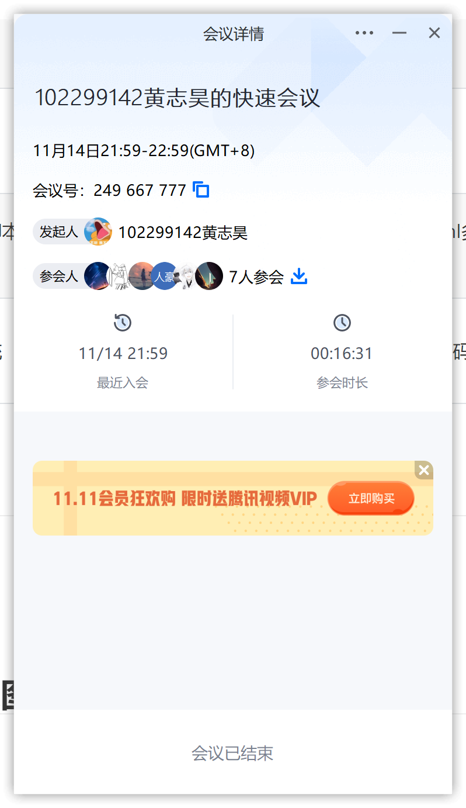
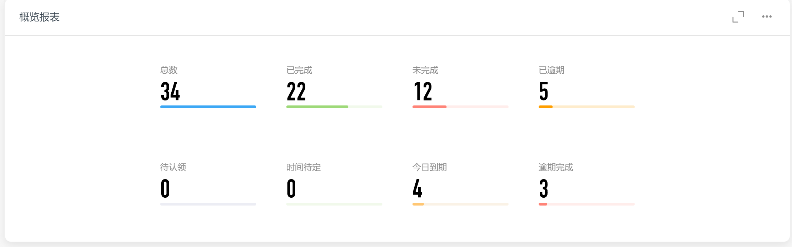
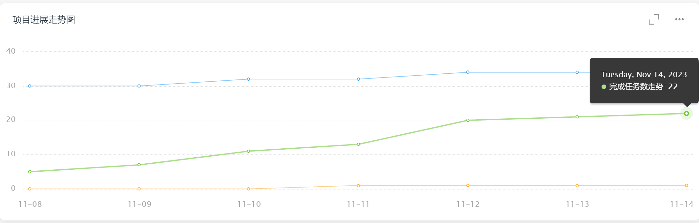
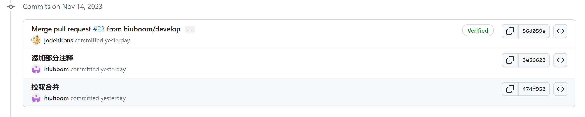
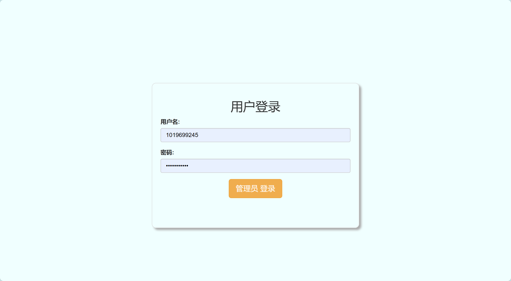
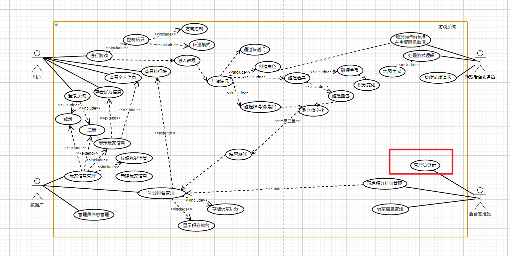

| 这个作业属于哪个课程 | [课程的链接](https://bbs.csdn.net/forums/fzusdn-0831?typeId=4994744) |
| -------------------- | ------------------------------------------------------------ |
| 这个作业要求在哪里   | [2023秋软工实践团队作业——alpha冲刺-CSDN社区](https://bbs.csdn.net/topics/617519084) |
| 作业目标             | 说明每日冲刺进度                                             |
| 团队名称             | ^o^☛我しΘνの軟件ユ徎(•̀ᴗ•́)و                                   |
| 参考文献             | Unity学习社区以及bilibili学习资料                            |

# 冲刺日志

## 项目进度追踪

| 人员   | 完成的任务                                                   | 完成任务时长（h） | 剩余时间（h） | 完成任务遇到的问题                           | 处理的方式                              |
| ------ | ------------------------------------------------------------ | ----------------- | ------------- | -------------------------------------------- | --------------------------------------- |
| 卢泽强 | 加入大裂谷地图                                               | 3h                | 0h            | 给船体加入枪时，不能控制枪的旋转             | 利用父子级关系，添加素材                |
| 周柯   | 排行榜链接数据库+UI优化                                      | 3h                | 0h            | 字符串匹配                                   | 强哥の点拨                              |
| 汪伟杰 | 为login script中的脚本和ObstacleScript中的脚本添加xml多行注释，练习单元测试脚本 | 3h                | 5h            | 单元测试脚本调用脚本对象不能正常运行生命周期 | 问gpt，查资料                           |
| 郑人豪 | 录制vlog                                                     | 3h                | 0h            | 无                                           | 无                                      |
| 郭巧婷 | 学习untiy动画状态机                                          | 1h                | 4h            | 无                                           | 无                                      |
| 王君妍 | 为player脚本和map脚本添加xml多行注释                         | 2.5h              | 0h            | 第一次接触xml多行注释                        | 查阅文字资料与视频资料，使用Copilot辅助 |
| 黄志昊 | 制作游戏后台管理系统                                         | 3h                | 4h            | django对接MySQL出现编码问题                  | 查阅资料                                |

## 今日会议

会议内容：

- 追踪各同学项目进度
- 询问单元测试遇到的问题

会议过程：

因为过程忘记截图、使用会议记录作为过程

## 钉钉项目统计展示图表：

​	

## GitHub签入记录

## 项目实现情况

主游戏还在编码阶段，还未有新进展。

游戏后台开始搭建：

## 燃尽图

## 实现对应UML

开始进行游戏后台的搭建：

完成管理员登录子用例。

## 成员贡献

| 人员   | 完成任务     | 贡献百分比 |
| ------ | ------------ | ---------- |
| 卢泽强 | 实现游戏裂谷 | 15%        |
| 周柯   | 完善游戏UI   | 15%        |
| 汪伟杰 | 尝试单元测试 | 17%        |
| 郑人豪 | 录制vlog     | 10%        |
| 郭巧婷 | 进行动画制作 | 10%        |
| 王君妍 | 尝试单元测试 | 13%        |
| 黄志昊 | 制作游戏后台 | 20%        |