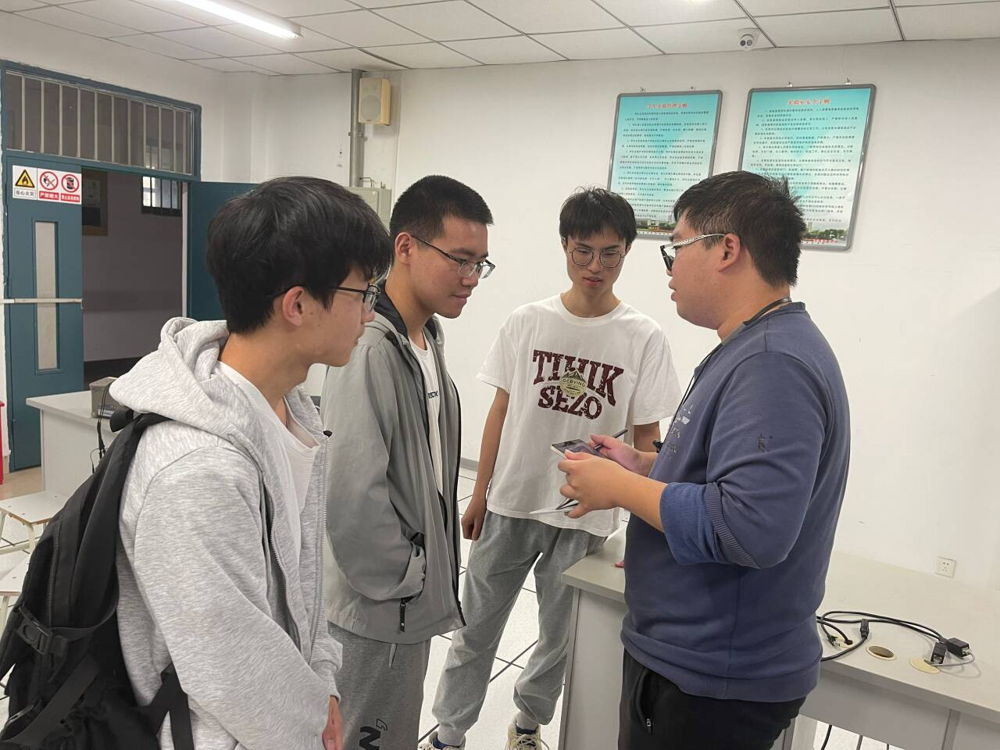
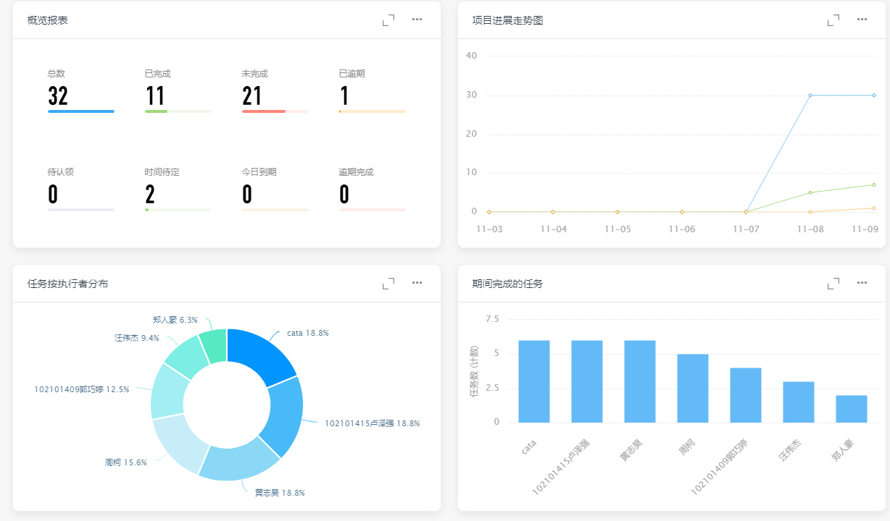
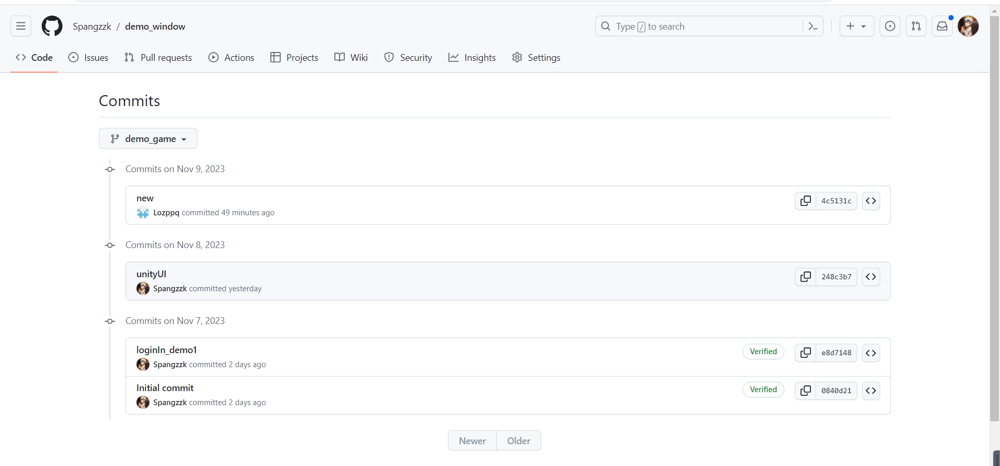
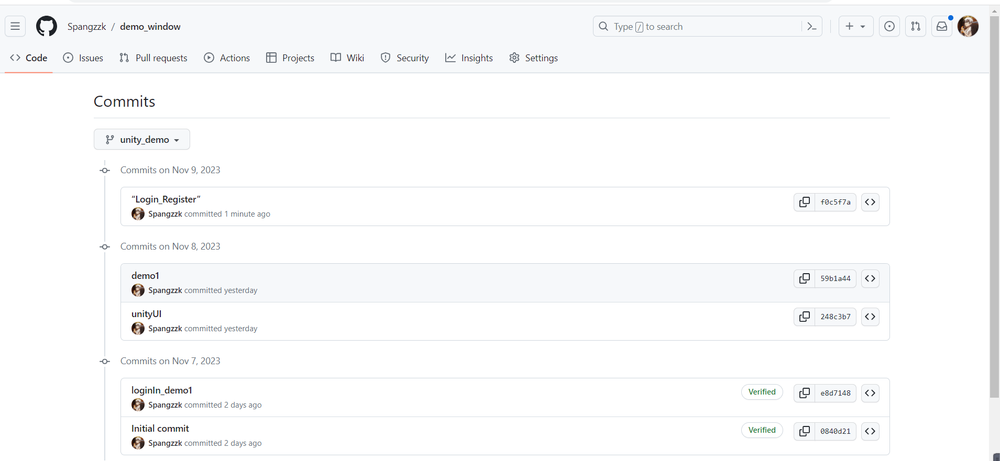
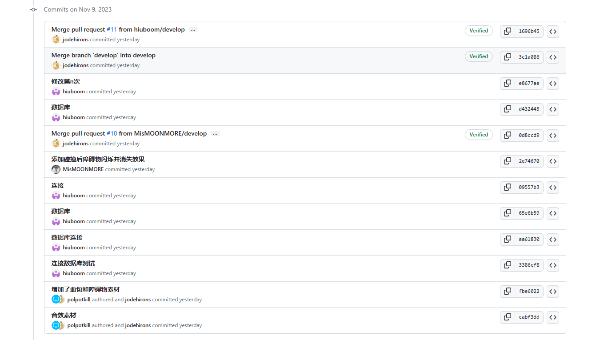
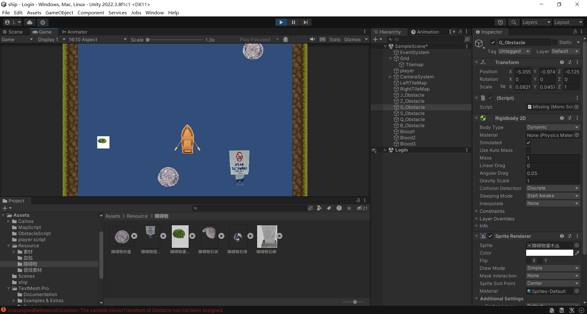
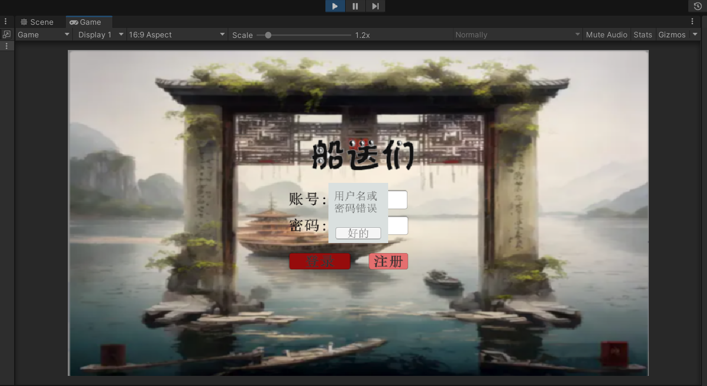
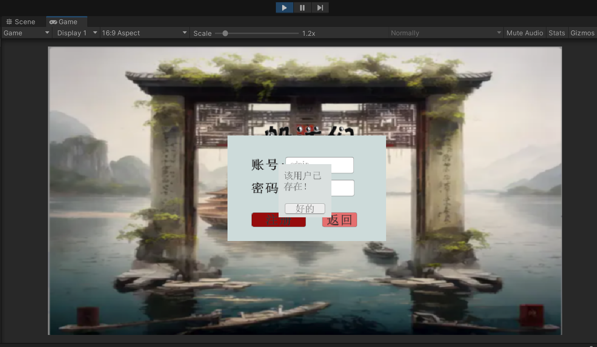
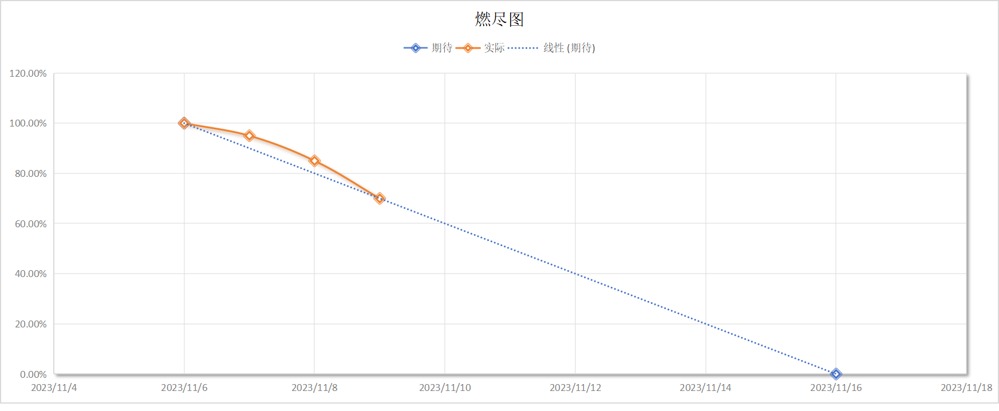
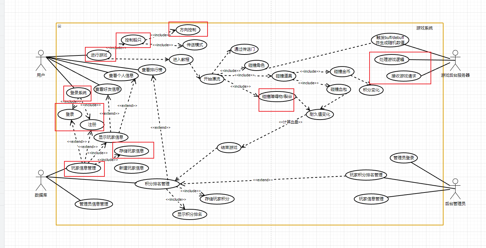

| 这个作业属于哪个课程 | [课程的链接](https://bbs.csdn.net/forums/fzusdn-0831?typeId=4994744) |
| -------------------- | ------------------------------------------------------------ |
| 这个作业要求在哪里   | [2023秋软工实践团队作业——alpha冲刺-CSDN社区](https://bbs.csdn.net/topics/617519084) |
| 作业目标             | 说明每日冲刺进度                                             |
| 团队名称             | ^o^☛我しΘνの軟件ユ徎(•̀ᴗ•́)و                                   |
| 参考文献             | Unity学习社区以及bilibili学习资料                            |

# 冲刺日志

## 项目进度追踪

| 人员   | 完成的任务                                                   | 完成任务时长（h） | 剩余时间（h） | 完成任务遇到的问题                                           | 处理的方式                                   |
| ------ | ------------------------------------------------------------ | ----------------- | ------------- | ------------------------------------------------------------ | -------------------------------------------- |
| 卢泽强 | 实现unity地图随机化无限生成                                  | 9h                | 0h            | 如何设置随机生成不会，对象引用和销毁方式不会                 | 使用类的继承，询问GPT                        |
| 周柯   | 登录功能与注册功能                                           | 9h                | 0h            | UI、C#、C#+MYSQL，不熟不会                                   | bilibili大学+组员+CSDN+GPT+TIME              |
| 汪伟杰 | 实现了unity与远程数据库的连接，完成数据库表格建立，还需后续等等。。。 | 9h                | 0h            | github版本错乱问题                                           | 查阅相关资料                                 |
| 郑人豪 | 修改游戏素材的大小并除去游戏素材的背景色                     | 4h                | 0h            | 对背景色的去除很不熟练，总是把素材搞坏...                    | 询问有经验的同学，并不断试错总结经验         |
| 郭巧婷 | 小船碰撞动画                                                 | 3h                | 0h            | 不知道怎么表现碰撞效果                                       | 查找资料和视频                               |
| 王君妍 | 障碍物碰撞事件优化                                           | 4h                | 0h            | 脚本无法运行                                                 | 查阅文字资料发现混用了2D组件和3D碰撞事件函数 |
| 黄志昊 | 在项目推进过程中统筹各成员进度、编写博客、对各成员问题提出建议、帮助各成员完成相关内容 | 9h                | 0h            | unity2d碰撞系统的应用尚未理解、GitHub数据出现版本错误一直无法修订 | 查阅unity相关文档、查看GitHub使用指南        |

## 今日会议

​	会议内容：作为校运会第一天的α冲刺，各组员均有大量的时间参与项目的工作，所以首先进行了当前项目进度的说明之后进行项目的分工，直接进入项目开发环节。

## 钉钉项目统计展示图表：

​	项目总体概况：

## GitHub签入记录

前台客户端commit记录：

游戏主体commit记录：

​	更新大量游戏内容、实现游戏UI形式的数据库对接登录系统以及碰撞系统、添加完善游戏素材：

​	

## 项目实现情况

​	当前游戏运行情况：

​	前端完成情况截图、实现登录成功与否检测、注册成功与否检测：

登录失败演示：

注册失败演示：

## 燃尽图

本日项目进度大幅推进：

## 实现对应UML

​	随着游戏制作的进行进一步跳转游戏的UML设计图、本日冲刺基本完成：

- 用户执行者的登录系统及其登录与注册用例，控制船只用例中的方向控制子用例、碰撞障碍物子用例
- 游戏后台服务器执行者的处理游戏逻辑、接受游戏请求用例
- 数据库执行者的玩家信息管理用例

## 成员贡献

| 人员   | 完成任务                                                 | 贡献百分比 |
| ------ | -------------------------------------------------------- | ---------- |
| 卢泽强 | 完了无限随机化地图的初步实现以及碰撞系统的并入           | 20%        |
| 周柯   | 接入汪伟杰同学部署好的数据库，实现了前端UI登录、注册功能 | 19%        |
| 汪伟杰 | 部署好MySQL数据库，实现和unity引擎的对接                 | 16%        |
| 郑人豪 | 游戏美术素材的优化                                       | 10%        |
| 郭巧婷 | 游戏碰撞动画的实现                                       | 11%        |
| 王君妍 | 碰撞效果和动画的实现                                     | 11%        |
| 黄志昊 | 整体项目的统筹和冲刺博客的撰写                           | 13%        |