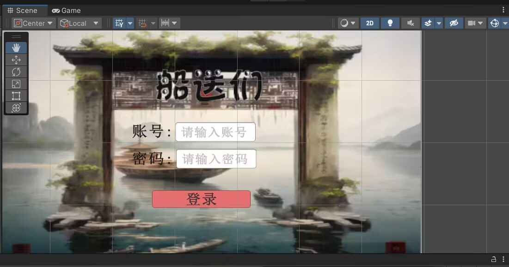
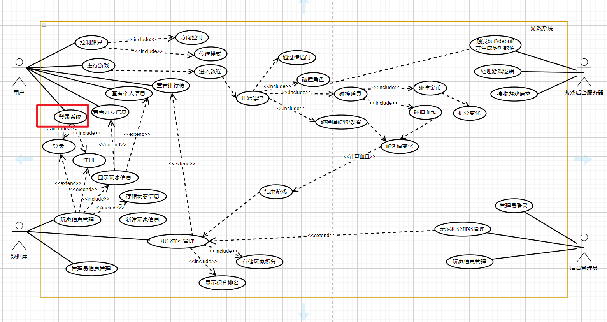

| 这个作业属于哪个课程 | [课程的链接]([2023秋-福州大学软件工程社区-CSDN社区云](https://bbs.csdn.net/forums/fzusdn-0831?typeId=4994744)) |
| -------------------- | ------------------------------------------------------------ |
| 这个作业要求在哪里   | [2023秋软工实践团队作业——alpha冲刺-CSDN社区](https://bbs.csdn.net/topics/617519084) |
| 作业目标             | 说明每日冲刺进度                                             |
| 团队名称             | ^o^☛我しΘνの軟件ユ徎(•̀ᴗ•́)و                                   |
| 参考文献             | Unity学习社区以及bilibili学习资料                            |

# 冲刺日志

## 项目进度追踪

| 人员   | 完成的任务                                         | 完成任务时长（h） | 剩余时间（h） | 完成任务遇到的问题                                           | 处理的方式        |
| ------ | -------------------------------------------------- | ----------------- | ------------- | ------------------------------------------------------------ | ----------------- |
| 卢泽强 | unity与web双版本登陆界面ui设计                     | 3h                | 0h            | 不会unity ui部分                                             | bilibili大学      |
| 周柯   | unity与web双版本登陆界面ui设计                     | 3h                | 0h            | 不会unity ui部分                                             | bilibili大学      |
| 汪伟杰 | 开始逐渐学习unity与数据库的连接                    | 2h                | 2h            | 版本问题，vs版本连接方式的不同，Connector/NET版本等等等。。。 | 查阅相关资料      |
| 郑人豪 | 开始学习unity中音效触发模块的实现                  | 3h                | 2h            | 对于unity的使用很不熟练                                      | 在b站学习相关内容 |
| 郭巧婷 | 游戏角色动画                                       | 3.h               | 0h            | 不同动作图片大小不同                                         | 重新调整素材大小  |
| 王君妍 | 结束Unity的使用、碰撞系统及事件触发的学习          | 3.3h              | 0h            | 如何使用素材建立一个简单系统用于实验                         | 查阅相关资料      |
| 黄志昊 | 整合各成员材料撰写博客，追踪项目精度，研究协作工具 | 3h                | 0             | 第一次使用钉钉不太熟练                                       | 查阅钉钉使用技巧  |

## 协作改进

​	为了更好追踪项目进度，使用钉钉创建α冲刺项目任务，并使用钉钉的统计报表进行分析、针对当前情况共安排30个子任务：

​	项目统计情况：

## GitHub签入记录

前台客户端commit记录：

UnityUI更新记录：

webUI更新记录：

游戏主体commit记录：

​	更新游戏动画内容与音效素材内容：

## 项目实现情况

​	动画制作情况：

​	

​	前端完成情况截图：

## 燃尽图

​	本次使用燃尽图为Excel手动绘制、待几天后钉钉收集足够数据则切换为钉钉的燃尽图

## 实现对应UML

​	针对实际情况对之前的用例图进行修改，添加登录系统用例，本日冲刺主要完成登录系统用例：

## 成员贡献

| 人员   | 完成任务                         | 贡献百分比 |
| ------ | -------------------------------- | ---------- |
| 卢泽强 | 完成了游戏登录UI的设计           | 16%        |
| 周柯   | 完成了游戏登录UI的设计           | 16%        |
| 汪伟杰 | mysql与unity对接的半实现         | 14%        |
| 郑人豪 | 音乐素材的上传以及音乐触发的学习 | 10%        |
| 郭巧婷 | 游戏基本动画的实现               | 15%        |
| 王君妍 | 物理碰撞的学习和修改             | 13%        |
| 黄志昊 | 项目统筹协调                     | 16%        |