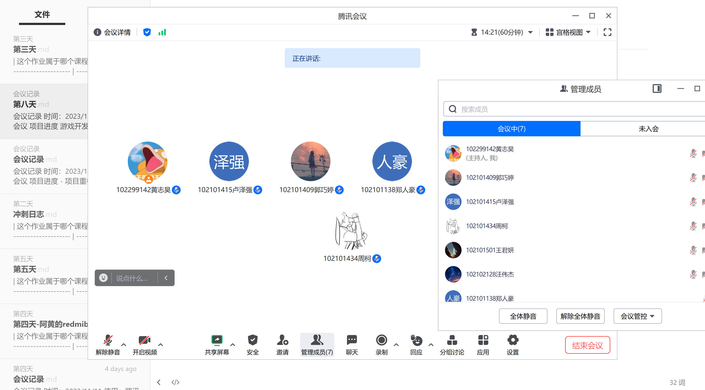
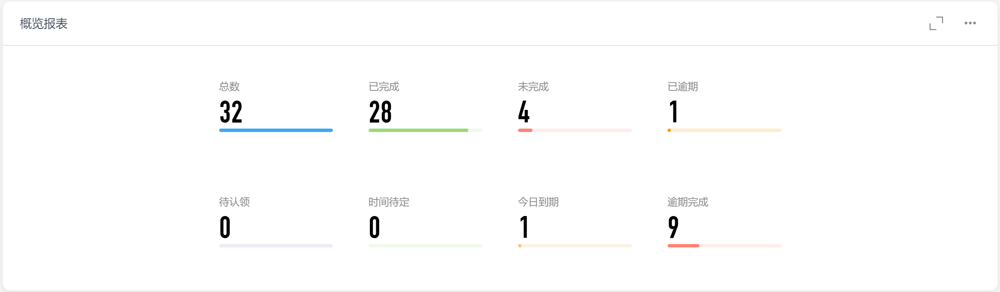
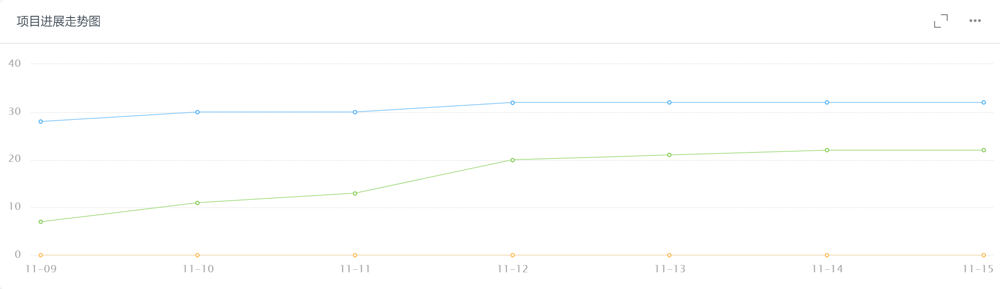
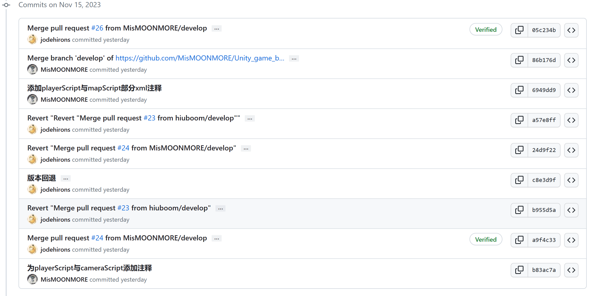
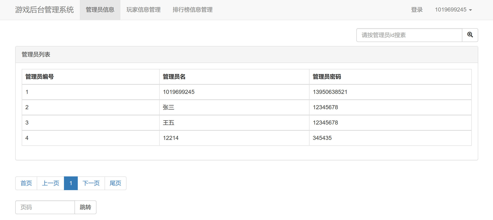
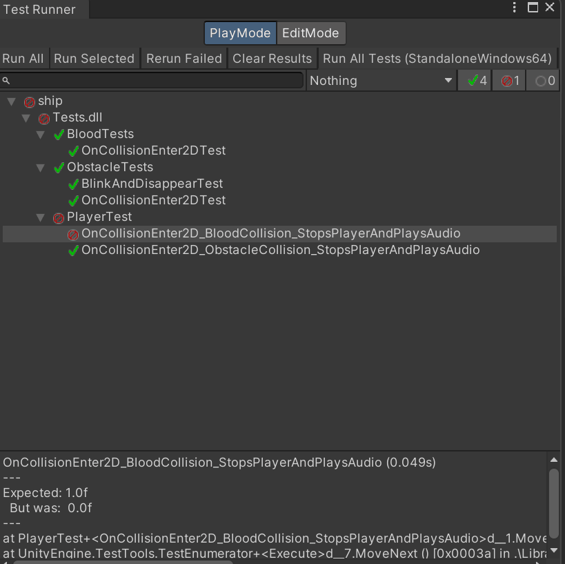
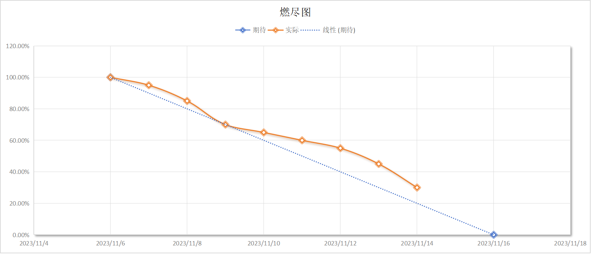
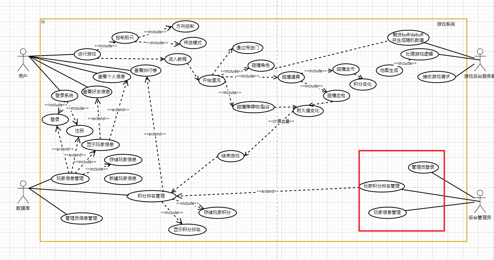

| 这个作业属于哪个课程 | [课程的链接](https://bbs.csdn.net/forums/fzusdn-0831?typeId=4994744) |
| -------------------- | ------------------------------------------------------------ |
| 这个作业要求在哪里   | [2023秋软工实践团队作业——alpha冲刺-CSDN社区](https://bbs.csdn.net/topics/617519084) |
| 作业目标             | 说明每日冲刺进度                                             |
| 团队名称             | ^o^☛我しΘνの軟件ユ徎(•̀ᴗ•́)و                                   |
| 参考文献             | Unity学习社区以及bilibili学习资料                            |

# 冲刺日志

## 项目进度追踪

| 人员   | 完成的任务                       | 完成任务时长（h） | 剩余时间（h） | 完成任务遇到的问题                                           | 处理的方式            |
| ------ | -------------------------------- | ----------------- | ------------- | ------------------------------------------------------------ | --------------------- |
| 卢泽强 | 实现大裂谷                       | 3h                | 0h            | 鼠标等控制恢复使用时间设置很难调                             | 设置为10s间隔使用一次 |
| 周柯   | 排行榜+设置页面功能完善          | 4h                | 0h            | 仓库覆盖本地，slider无法引用                                 | 重做，空指针判断      |
| 汪伟杰 | 完成碰撞测试脚本的实现           | 3h                | 5h            | Could not load type 'Castle.Proxies.GameObjectProxy' from assembly 'DynamicProxyGenAssembly2....... | 没解决换其他方法了    |
| 郑人豪 | 拍摄并剪辑vlog                   | 3h                | 0h            | 无                                                           | 无                    |
| 郭巧婷 | 学习unity动画的状态机            | 3h                | 0h            | 无                                                           | 无                    |
| 王君妍 | 对player脚本与map脚本进行测试    | 3h                | 10h           | 测试脚本无法运行                                             | 尚未解决              |
| 黄志昊 | 综合项目进度、制作管理员后台页面 | 4h                | 4h            | 太久未使用django框架导致有点生疏                             | 熟练熟练              |

## 今日会议

会议内容：会议时间2023/11/15

- 追踪游戏开发进度
- 追踪单元测试完成情况

会议过程：

## 钉钉项目统计展示图表：

项目即将完成α版本：

## GitHub签入记录

今天上传的部分主要是给已经实现的函数添加部分注释：

## 项目实现情况

继续推进游戏后台页面的具体实现：

一部分unity游戏代码经过单元测试：

## 燃尽图

## 实现对应UML

今天主要完成后台管理员对应的几个子用例

## 成员贡献

| 人员   | 完成任务               | 贡献百分比 |
| ------ | ---------------------- | ---------- |
| 卢泽强 | 推进大裂谷制作         | 15%        |
| 周柯   | 完成游戏排行榜         | 15%        |
| 汪伟杰 | 推进单元测试           | 15%        |
| 郑人豪 | 拍摄vlog               | 13%        |
| 郭巧婷 | 制作unity动画及其转换  | 14%        |
| 王君妍 | 推进单元测试           | 13%        |
| 黄志昊 | 制作游戏后台，撰写博客 | 15%        |