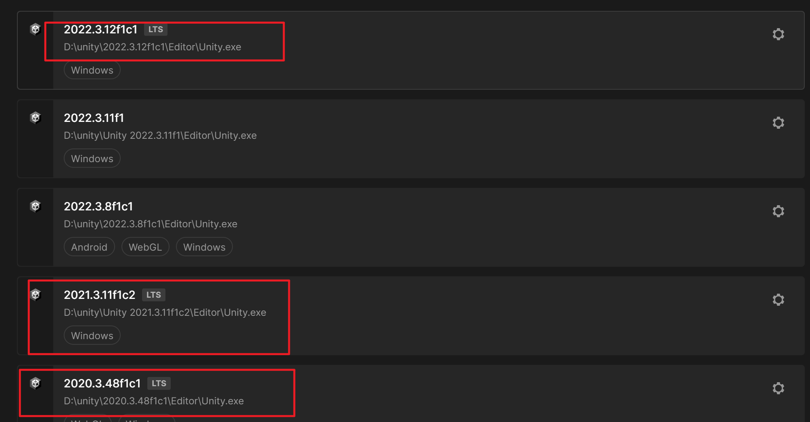
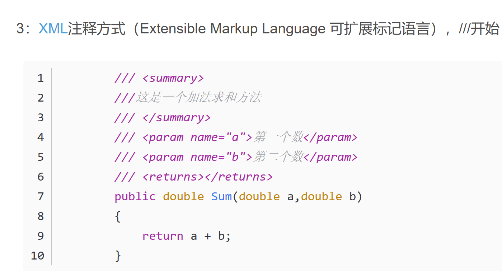

# 会议记录

时间：2023/11/11

使用：腾讯会议

# 项目进度

- 基本完成游戏登录主页面和排行榜页面
- 地图生成算法的完成
- 各种动画的完成

# 项目版本管理

[图文详解如何利用Git+Github进行团队协作开发 - 知乎 (zhihu.com)](https://zhuanlan.zhihu.com/p/23478654)

- main分支--发行版本分支
- develop--开发版本分支
- feature--功能模块分支
- hotfix--紧急修复分支

尽量使用fork--request的方式进行项目的推送，不然可能游戏仓库中看不出commit记录

# 游戏开发问题

1. 统一unity版本，尽量使用lts，长期支持版本

​	2.游戏开发流程改变：做完一个模块不仅需要进行运行测试，还需要进行导出测试、导出之后才能发现运行游戏时的问题

​	3.代码撰写规范

命名法则 :[推荐：12条C#命名规范！ - 知乎 (zhihu.com)](https://zhuanlan.zhihu.com/p/376111503)

注释：对于每一个函数和方法应该写好注释

# 任务安排：

重要人物：重构项目--进行webgl的排查实现

我们把项目重构完之后，再进行新功能的开发、统一unity版本

汪同学和王同学在接下来的2-3天内进行单元测试、修缮代码（注释以及命名规范）、其余同学继续功能的开发