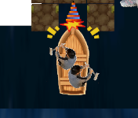
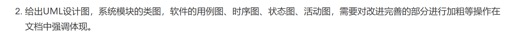

| 这个作业属于哪个课程 | [课程的链接](https://bbs.csdn.net/forums/fzusdn-0831?typeId=4994744) |
| -------------------- | ------------------------------------------------------------ |
| 这个作业要求在哪里   | [2023秋软工实践团队作业——beta冲刺-CSDN社区](https://bbs.csdn.net/topics/617618772) |
| 作业目标             | 说明β冲刺进度并对冲刺做出总结                                |
| 团队名称             | ^o^☛我しΘνの軟件ユ徎(•̀ᴗ•́)و                                   |
| 参考文献             | Unity学习社区以及bilibili学习资料                            |

[toc]

# 一、问题清单及解决过程

​	在α冲刺之后，项目中还存在诸多问题有待解决。

## 1. 问题清单

1. **游戏的结算界面有图层错位bug尚未修复**

2. **游戏的排行榜表单存在bug，更高分数的队伍并没有被显示出来。**

3. **游戏需要加入最后的救人功能：**

- 中间需要有一个障碍物隔开两个被救助人员，玩家一次只能救一个人
- 被救的人会给玩家上buff，没被救的人会给玩家上debuff：比如救男神会让玩家防御力上升，但是没被救的女神会让水的流速加快，救女神会让水的流速减慢，但是男神没被救会让船的防御力减弱，先做一组救人组合就好。buff的数值可以在一定范围内随机（画面上应当有相应字体提示：防御力增强、速度加快之类）
- 男神女神应有相应的求助音效，被救音效以及淹死音效。

4. **游戏的动画需要进一步完善--需要能够看出玩家是在向左还是向右划船，传送门的颜色应该有所区分，需要一个橙色的传送门。**

5. **游戏中的美术素材可以再加入一些新的内容，更加体现一些福大的特色。**

6. **游戏中的UML图应当根据实际游戏的运行情况有所更新。**

7. **游戏应当能导出为WEBGL并实现和数据库的对接（写一层JavaScript或PHP语言进行调用），之后再进行相应的部署**。

8. **针对新加入的游戏功能（传送门和救人），撰写相应的单元测试。（已撰写的单元测试文件先备份好，仓库里的单元测试内容在我重构的时候被删除了）**

9. **给游戏加入相应的教程页面和相关说明，游戏中应当有相应的暂停页面（和登录时一样就好）**

- 可以是简单的几页静态页面

## 2. 探索思路

​	在11月27日使用腾讯会议召开会议讨论任务的安排及分工，对项目作进一步的完善。因为临近期末大家都有考试的任务，所以任务的安排均以最低要求为标准。绝大部分任务以有解决的方法和解决的思路，主要问题在于如何让导出的webgl对接上数据库。

​	之后通过QQ群聊天协商，最后我和汪同学共同商议采用套娃的方式，编写PHP语言部署在腾讯云数据库，由unity调用PHP语言，再由PHP代码调用数据库来返回信息，以套娃的形式实现webgl对接MySQL数据库：

## 3. 解决过程

​	在α冲刺的过程中团队已经解决了大部分的问题，所以在β冲刺的情况下团队按照上述的安排继续开发游戏剩余的内容即可，详情请看团队协作记录。

​	对于webgl的导出，我们购买基于Linux的腾讯云服务器宝塔面板版本，进行使用。

​	使用Nginx进行反向代理，配置路由：

​	撰写好相应的PHP代码，并对unity代码中对于数据库调用部分的代码进行修改，导出相应的项目为webgl，并和PHP文件一起放入云服务器中的特定位置：

​	这样即可实现整个webgl游戏在服务器上的部署。

# 二、面向对象设计

​	根据当前实现的内容优化UML图例，并标注β冲刺重点完成部分。

### 1. 用例图

​	用例图在之前的α冲刺中已多次修改，本次β冲刺主要实现“碰撞人物”用例。

### 2. 类图

​	类图主要是修改了游戏类，为游戏类添加声明状态的属性status以及退出游戏的方法quit()，暂停游戏的方法pause（）。其和people类是β冲刺中实现的重点：

### 3. 游戏类状态图

​	对游戏类的状态转换进行描述如下：

###  4.时序图

​	对游戏作时序图描述如下：

### 5. 活动图

​	根据项目的具体实现情况修改活动图，其中“碰撞救人”是β冲刺实现的重点：

### 6. 协作图

# 三、项目具体进展

## 1. 项目网址

β版本项目已部署于：》》》》》[双人合作划船游戏](http://43.143.185.60/)《《《《《《《

## 2. 当前项目进度

- 游戏的基础玩法设计（无限地图生成、传送门、碰撞（血包、金币、障碍物）、救人）功能已实现
- 游戏的基础页面UI，包括前端登录页面、注册页面、教程页面、游戏结束页面、排行榜页面、游戏暂停页面等已经实现
- 游戏的基础动画设计及动画转换逻辑以实现并时装在游戏上
- 游戏已对接数据库、能及时上传游戏数据到数据库
- 游戏的后台管理系统（玩家信息管理、排行榜记录管理及分析）已实现（尚未部署）
- 对游戏主体玩法已进行单元测试及分析

## 3. 项目介绍

​	β冲刺版本相比α冲刺版本最重要更新就是：

	1. 成功部署于网页上
	1. 添加了救人系统

项目具体的介绍如下：

### 游戏登录界面

​	进入项目可以看到游戏登录界面，在主登录框可以输入用户的账号密码进入游戏，如果没有账号密码可以点击“注册”按钮进行注册，登录和注册的时候会进行基础的账号密码检查和提示。右上角三个按钮的功能分别为开关背景音乐，查看排行榜以及设置界面：

​	在设置界面我们可以调节游戏的音乐大小，并查看游戏的操作说明：

​	本游戏为双人合作划船游戏，玩家1使用键盘A/D控制划船方向，Q/E控制发射传送门的箭头方向，W发射传送门；玩家2使用键盘←/→控制划船方向，鼠标控制传送门发射位置（玩家2可以往任意位置发送传送门），鼠标左键发射传送门。

​	点击排行榜，可以查看当前个人排名及排行榜排名前十的队伍：

​	点击注册一个可用账号之后，可以使用账号登录游戏，如果账号密码不对，则会弹出提示：

### 主体游玩界面：

​	进入游戏之后我们可以看到两位玩家的角色及游戏地图，小船会随着水流顺流而下，途中会遇到障碍物和血包。玩家共有十点血量，撞上障碍物会扣除一点血量并减十分，撞上血包会加上一点血量并加十分。

​	游戏的游玩过程中存在“救人系统”，会在障碍物两旁出现男生“丁假”以及女生“永雏唐菲”，如果救“丁假”会收到“丁假”的祝福，船会变小，但是会受到“永雏唐菲”的诅咒，水流的流速会加快。如果救“永雏唐菲”则会相反，船会变大但是水流流速会减慢。

救助“丁假”效果：

救助“永雏唐菲”效果：

​	同时游戏的过程中会遇到大裂谷，玩家需要使用传送门的方式通过，不然等同于碰撞障碍物：

​	在游戏过程中玩家可以按下键盘“P”键暂停游戏进入暂停菜单：

​	游戏的暂停菜单会显示玩家的分数及相应的选项，玩家也可以查看排行榜。

​	在排行榜中，属于玩家的对于以及分数会被标红：

​	随着游戏时间的增加水流的流速会越来越快，当玩家血量归零时，游戏结束，弹出游戏结束菜单：

​	玩家可以进行“上传成绩”，“重新开始等操作”。

​	上传成绩时玩家可以输入合作玩家的ID或是选择“和陌生人合作”，之后系统会检测玩家的分数是否超过之前的记录，提示成绩是否有更新：

​	具体情况还请大家自行游玩（品鉴）。

# 四、单元测试

​	在β冲刺中，使用Unity自带的Unity Test Runner测试系统编写代码对游戏的功能进行测试。因为游戏的主要功能已经测试完成，所以在β冲刺中，我们的主要测试人物是测试新加入的救人系统功能

之前的α冲刺测试结果（血包碰撞功能已修复）：

β冲刺新增测试内容：主要是对救人系统进行测试

**详细的测试代码及内容请看测试报告：[β冲刺测试报告](https://www.kdocs.cn/l/chXCghwLDYtd)**

# 五、团队协作记录

## 1. β冲刺GitHub提交记录

## 2. 腾讯会议记录

# 六、成员的体会及收获总结：

#### 黄志昊：

​	其实如果你问我“冲得爽不爽”我一定会回答“爽！”，但是如果你问我“还要不要再来一次”那我一定会回答“不了不了，下次别来了”。我觉得在这次冲刺过程中我就像做了一个梦，一个名为游戏开发的梦，在这个梦里面我可以调配下面的员工，尽情得开发我的游戏。我是项目经理，我是游戏导演，我是总工程师，甚至我能对着镜子说三遍“我是小岛秀夫，我是小岛秀夫，我是小岛秀夫。”不知道当年小岛秀夫第一次做游戏的时候是什么感受，他是学电影出生的，最想拍的是电影，最后却投身于游戏行业的艺术创作，不知道他第一次做游戏的时候是不是一样迷茫，是不是也一样无措，这些我都不知道，我只能抬头看见一个60岁的人却神采奕奕，站在全球最高最瞩目的游戏发布会上，介绍他自己的游戏。所以，“我不是小岛秀夫”。所以，美梦会醒。

​	美梦醒来的第一天，α冲刺结束的那一天，我做了一晚上噩梦，睡了醒，醒了睡。第二天，重感冒，然后，咳嗽到现在，医生说我支原体感染了，建议我挂瓶。

​	“憧憬是距离理解最遥远的距离”,不过其实，我早就不憧憬了，我早就明白做游戏有多复杂多困难，只是，需要有个人，有件事来戳穿这个泡沫。所以，我很感想这次冲刺的机会，让我真正尝试做了一次游戏，让我体会到了一遍做游戏的过程。

​	“下次不来了”，不是指不再来做游戏了，是指“不会像第一次那样”蠢笨无知得做游戏了，如果有下一次，肯定比这次更好，毕竟，我觉得这次其实做得还不错，理解了项目管理，尝试了游戏开发，“必能活用于下一次”。

#### 周柯：

​	张老师及助教们布置的软工作业神中神，应该算是高三以来最符合我认知的计算机课程了，量大管饱，管掉发。在经历了个人作业、双人作业后，一度难以想象团队作业会有多有趣（变态）。很幸运的是，遇到了黄总，非常优秀的Leader。我们竟然，真的在大学期间，一笔一划的按照课程要求在完成小组作业？？？？我靠，这种感受真的非常让我这奔4（大四）的老东西感到新奇。团队配合交流磨合，看着项目一丢丢的推进，感慨万千。放眼去，全是黄总伟岸的英姿在驮着团队向前进。只能说，如果大三上课没那么多就好了，如果大一大二就在上就好了，如果。。。。。也正因这千万的如果，更显现这个选择有多么的珍贵——选了张老师的课，和黄总和其他成员一个团队下，这几个月来的项目经历，是多么的幸运是多么的可贵。成长性拉满。

#### 卢泽强：

​	在使用Unity制作船送门游戏的过程中，我不仅学习了如何利用各种功能和工具创建富有挑战性的游戏环境，还深入了解了游戏对象、场景管理和物理引擎等方面的知识。通过实践和探索，我获得了许多宝贵的经验和收获。在团队合作方面，我也受益匪浅。制作一个完整的游戏需要不同人员的协作，例如程序员、美术设计师和音效工程师等。我们必须密切合作，进行沟通和协调，以确保项目的顺利进行。这个过程教会了我如何有效地与他人合作，并提高了我的沟通和团队合作能力。此外，在制作划船游戏的过程中，我遇到了许多挑战和障碍，例如碰撞检测问题和游戏性调整等。通过调试和寻找解决方案，我学会了分析问题原因，并采取相应的措施来解决问题。这种解决问题的能力对于游戏开发以及其他领域都非常重要。最重要的是，通过制作划船游戏，我体验到了创造力和乐趣。能够看到自己设计的游戏慢慢成形，为玩家带来乐趣和挑战，给予我巨大的满足感。这种创造力的释放和游戏开发的乐趣让我更加热爱这个领域，并激发了我继续学习和探索的动力。

​	总而言之，通过Unity制作船送门游戏，我不仅获得了实际的技术知识和团队合作能力，还感受到了创造力和乐趣。这将对我的未来发展产生积极的影响，激励我在游戏开发领域持续努力和进步。

#### 郑人豪：

​	在软工之前的课程里，我没有接触到多少游戏开发的相关知识，所以只能从零开始自学。在开发过程中遇到的各种稀奇古怪的问题暴露了我自身的不足。在github的协作上，自己fork的仓库要一直记得更新，网络不好时经常在更新后还是落后当前版本，提交某些修改后稍不注意就会把他人更新的内容覆盖，因此在提交前还是需要再三检查。在素材收集方面，我根据游戏的需要进行取景拍摄，不少素材在用ai抠图的后，ai抠出的内容很多不是我需要的部分，最后还是不得不自学ps的相关知识人工抠图。游戏音频模块的实现也有不少困难，在把各种音频绑定到对应实体的过程中困扰了我很久，最后还是在主力开发队友的帮助下才完成。还有很多音频素材在游戏中直接使用会显得有延迟，所以我又学了点Au的知识来剪辑音频的高频部分来作为素材。在用ai做人物配音时也花了不少时间找合适的模型，并调整模型的一些参数来使配音更加契合游戏。总的来说，这次实践既让我收获了平常一直懒得学的知识，也让我发现了自己的不足。

#### 郭巧婷：

​	经历了两个多月的软工游戏项目开发，终于快要结束了，感觉身心俱疲。不过通过这个项目，我也收获了很多宝贵的经验和技能。在这次的游戏开发中，我主要负责美术素材和游戏动画的制作。使我对PS的使用更为的熟练，也学习了一些动画制作的技巧，制作关键帧动画。在完成任务的过程中，还要兼顾学习和考试，需要合理安排时间，提高自己的时间管理能力，确保任务的按时完成。这次的游戏开发虽然艰辛，但也是一次对自己的历练，提高了团队协作的能力。

#### 汪伟杰：

​	在我们团队的协作中，完成了C#调用PHP连接数据库的任务，取得了显著的成果。团队成员在整个过程中展现了卓越的合作精神和高效的沟通能力。通过有效的分工，每个成员都专注于任务的不同方面，从而提高了工作效率。在这个过程中，我们深刻体会到了团队协作的重要性。通过定期的沟通会议和协作工具的使用，我们成功地解决了遇到的问题，并保持了团队的紧密联系。团队成员之间的相互支持和协作，使得整个项目的推进更加顺利。总的来说，我们团队在团队协作、问题解决和技术提升等方面都取得了丰硕的成果。这次经历不仅对个人成长有益，也为未来的合作奠定了坚实的基础。

#### 王君妍：

​	即使已经有了α冲刺阶段编写测试的经验，β阶段的测试过程依然是不那么顺利的，但是相对而言结果比较成功，所以积累了更多可用的经验：

​	首先对于Unity Test Runner而言，EditMode和PlayMode测试各有优劣：EditMode测试编写可以更加灵活定义一个对象，相对更加“单元性”，但因为不是在运行过程中测试，一些方法可能因此变得不可使用，本次遇到的典型例子是Destroy（）和音频播放（无法获取Audio Source）。PlayMode测试没有那么灵活，如果将功能分开测试可能会出现一些相关的对象无法手动创建的情况。本次使用了Debug.Log的方法发现了这个问题。总结两点：

1. 测试的意义在于确认符合xx条件的情况下xx功能是否运行，如果某功能无法运行，可以在相应的块下添加一个可运行的功能来替代，比如设一个值或打印某个结果。
2. 可以根据不同的代码情况使用不同测试方法。

# 七、仓库链接

游戏主体仓库：[双人合作划船游戏 ](https://github.com/jodehirons/Unity_game_bowing)

后台管理系统仓库：[后台管理系统](https://github.com/jodehirons/unity_myback)

项目文档仓库：[软件工程合作项目PPT汇总页面 (github.com)](https://github.com/jodehirons/Unity_PPT)

# 八、β冲刺更新vlog

​	我可不是娇滴滴的女王，有的是力气，和手段！

​	