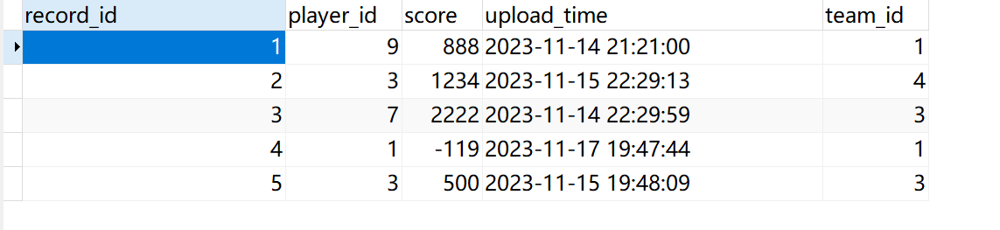
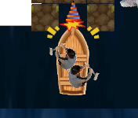
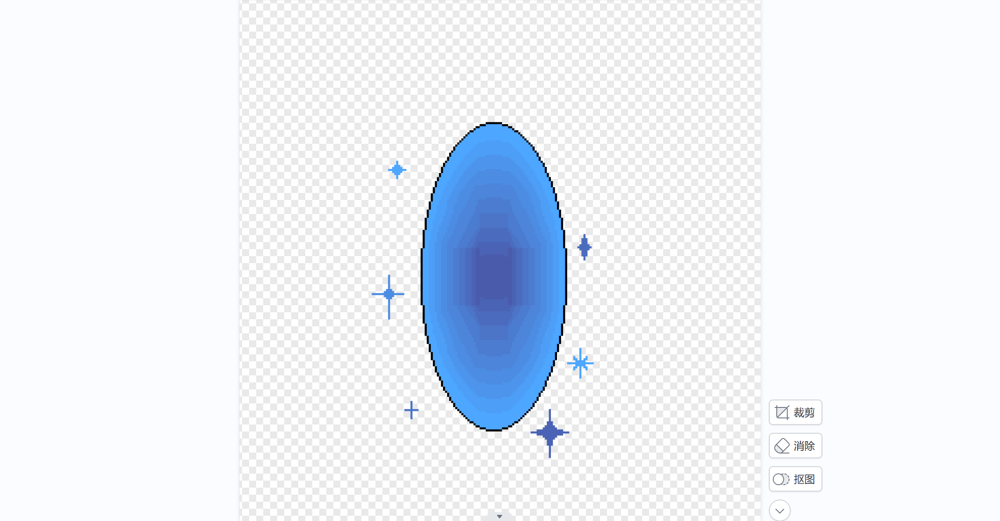
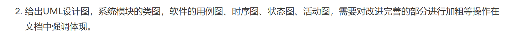
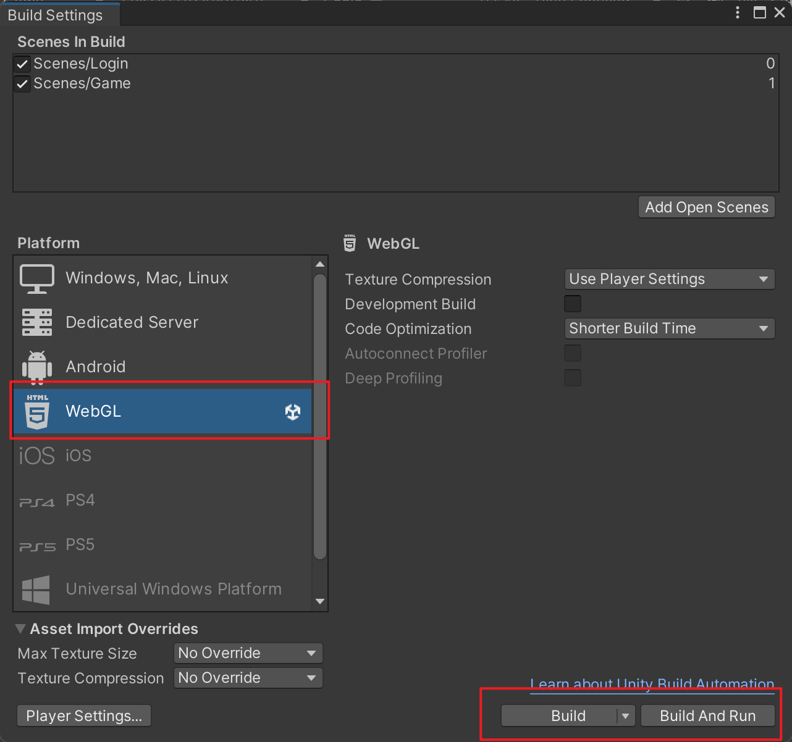
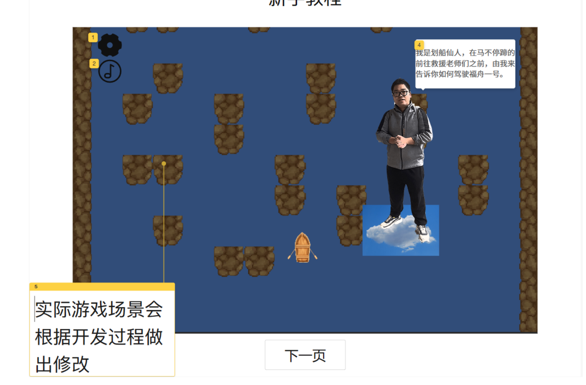

# 会议记录

时间：2023/11/27

使用：腾讯会议

# β冲刺时间

- 提交时间2023/12/16
- 从今天开始共有20天的时间

# 项目剩余任务

1. 游戏的结算界面有图层错位bug尚未修复

2. 游戏的排行榜表单对接有所错误，应对接record表用来展示排行榜记录

- 游戏结束时需要同时调用record表，先记录record表的内容（玩家id，团队id，记录时间，队伍分数）

- 然后再判断分数是否大于团队最高分，再更新team表

3. 游戏需要加入最后的救人功能：

- 中间需要有一个障碍物隔开两个被救助人员，玩家一次只能救一个人
- 被救的人会给玩家上buff，没被救的人会给玩家上debuff：比如救男神会让玩家防御力上升，但是没被救的女神会让水的流速加快，救女神会让水的流速减慢，但是男神没被救会让船的防御力减弱，先做一组救人组合就好。buff的数值可以在一定范围内随机（画面上应当有相应字体提示：防御力增强、速度加快之类）
- 男神女神应有相应的求助音效，被救音效以及淹死音效。

4. 游戏的动画需要进一步完善--需要能够看出玩家是在向左还是向右划船，传送门的颜色应该有所区分，需要一个橙色的传送门。

5. 游戏中的美术素材可以再加入一些新的内容，更加体现一些福大的特色。

6. 游戏中的UML图应当根据实际游戏的运行情况有所更新。

7. 游戏应当能导出为WEBGL并实现和数据库的对接（写一层JavaScript进行调用），之后再进行相应的部署。

8. 针对新加入的游戏功能（传送门和救人），撰写相应的单元测试。（已撰写的单元测试文件先备份好，仓库里的单元测试内容在我重构的时候被删除了）

9. 给游戏加入相应的教程页面和相关说明，游戏中应当有相应的暂停页面（和登录时一样就好）

- 可以是简单的几页静态页面

10. 现在游戏仓库里面使用的字体是微软雅黑，目前这个字体比较通用。

# 任务安排

第一周：

- 修复图层错位bug
- 修正排行榜
- 优化游戏动画
- 加入新的美术素材
- 加入新的救人系统
- 优化UML图表
- 导出成webgl

第二周

- 优化游戏的UI界面，使其更加美观
- 撰写单元测试，编写报告
- 部署项目

# 人员分工

| 人员   | 负责任务                                                   |
| ------ | ---------------------------------------------------------- |
| 卢泽强 | 加入救人系统                                               |
| 周柯   | 修复UI界面错误，完善UI界面和排行榜                         |
| 汪伟杰 | 让webgl能够调用数据库，导出项目到webgl                     |
| 郑人豪 | 收集新的音效和美术素材，有福大特点的素材                   |
| 郭巧婷 | 优化游戏动画，能够看出玩家在往哪边划、完成男神和女神的画像 |
| 王君妍 | 优化UML，撰写新的单元测试                                  |
| 黄志昊 | 统筹整合项目                                               |