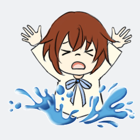
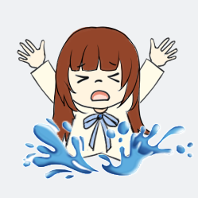

# 会议记录

时间：2023/12/03

使用：腾讯会议

# 当前项目问题

1. 游戏的动画的进度

- 游戏的男生女生图已画出，但需要进一步的修改增加二者的区分度。

- 橙色传送门已完成
- 游戏的划船转换动画还未完成，争取下周内完成

3. 游戏的UML及单元测试的进度

- 游戏的UML今晚基本绘制完毕。
- 单元测试尚未完成，应在功能全部实现后尽快完成。

4. 网页端对接的进度

[【腾讯云轻量级服务器】腾讯云服务器，Linux宝塔，Unity导出WebGL并部署-CSDN博客](https://blog.csdn.net/weixin_45775438/article/details/129426753?utm_medium=distribute.pc_relevant.none-task-blog-2~default~baidujs_baidulandingword~default-2-129426753-blog-121502121.235^v39^pc_relevant_anti_vip&spm=1001.2101.3001.4242.2&utm_relevant_index=5)

[【Unity 导出 WebGL 通过Linux宝塔的 Nginx 连接数据库】使用 UnityWebRequest 与 WebAPI (php服务) 执行mysql命令-CSDN博客](https://blog.csdn.net/weixin_45775438/article/details/130116593)

​	网页端部署由我及汪同学一并实现，使用PHP语言或JavaScript语言调用数据库实现webgl的数据库对接。

5. 游戏的音效以及图片

  - 音效已经基本完成，应整合到游戏中（被救者出现时应不停喊出help语音，救人时被救者应说出被救话语，同时触发另一人落水音效，等被救者话语说完之后，落水者再说出落水感言）。

  - 游戏的障碍物添加小白

  - 游戏两道的背景可以添加新的景物

    

# 任务安排

第二周

- 完善相应的功能、添加新的障碍物以及景物
- 对接好动画以及音效
- 导出部署到服务器。

# 人员分工

| 人员   | 负责任务                                     |
| ------ | -------------------------------------------- |
| 卢泽强 | 基础完善相关游戏功能                         |
| 周柯   | 完善游戏UI界面                               |
| 汪伟杰 | 实现webgl的导出及其与服务端的对接            |
| 郑人豪 | 扣出相关景物供背景使用，完成游戏中音效的触发 |
| 郭巧婷 | 完善游戏动画，优化被救者图片                 |
| 王君妍 | 完善UML的撰写，撰写单元测试                  |
| 黄志昊 | 统筹整合项目，帮助导出webgl                  |