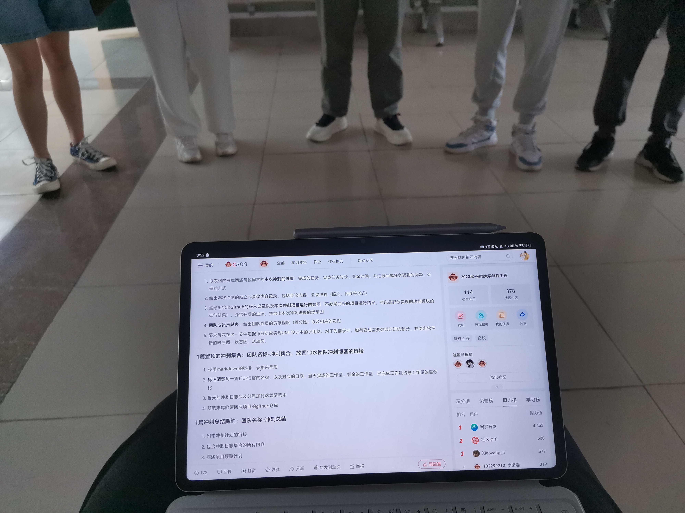
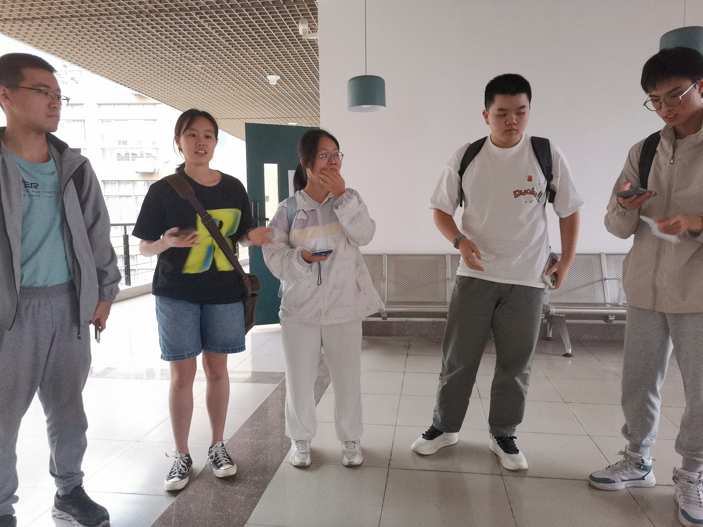
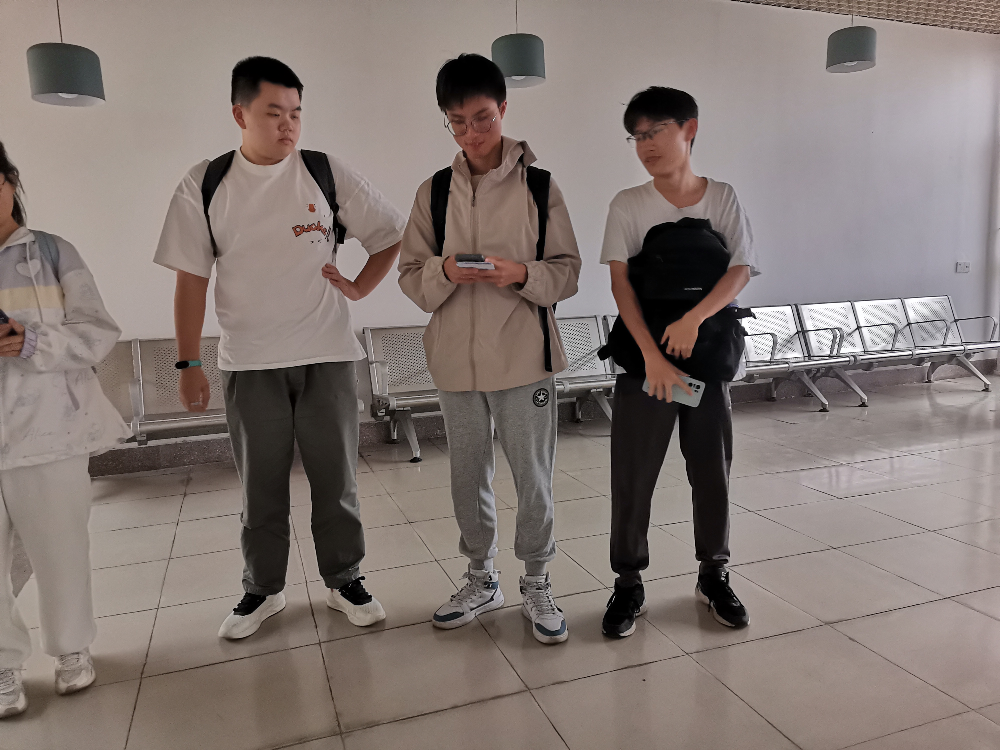
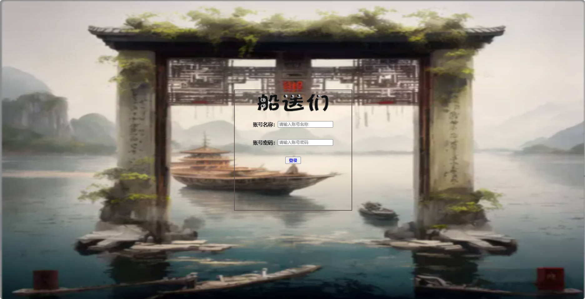
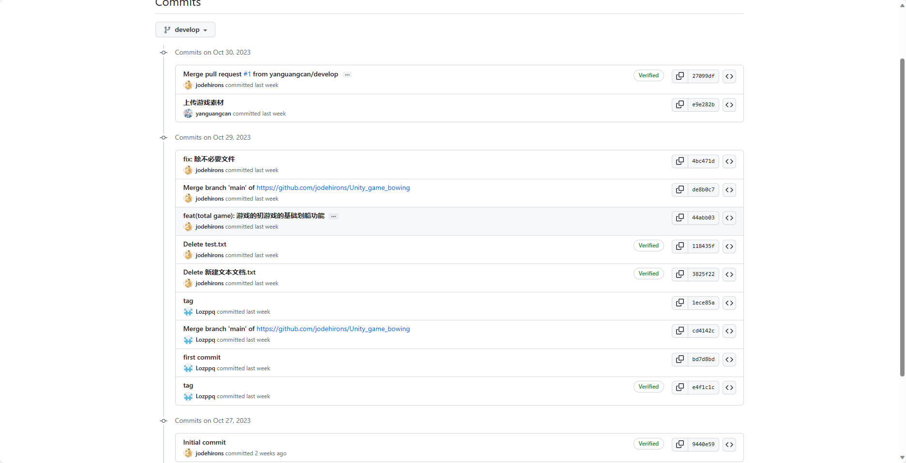
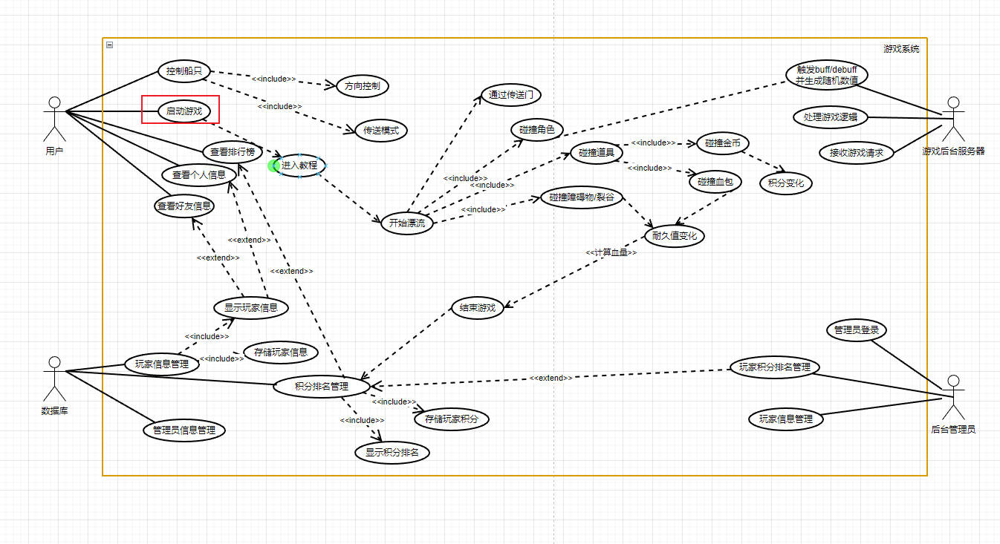

| 这个作业属于哪个课程 | [课程的链接]([2023秋-福州大学软件工程社区-CSDN社区云](https://bbs.csdn.net/forums/fzusdn-0831?typeId=4994744)) |
| -------------------- | ------------------------------------------------------------ |
| 这个作业要求在哪里   | [2023秋软工实践团队作业——alpha冲刺-CSDN社区](https://bbs.csdn.net/topics/617519084) |
| 作业目标             | 说明每日冲刺进度                                             |
| 团队名称             | ^o^☛我しΘνの軟件ユ徎(•̀ᴗ•́)و                                   |
| 参考文献             | Unity学习社区以及bilibili学习资料                            |

# 冲刺日志

## 项目进度追踪

| 人员   | 完成的任务                                                   | 完成任务时长（h） | 剩余时间（h） | 完成任务遇到的问题                                           | 处理的方式             |
| ------ | ------------------------------------------------------------ | ----------------- | ------------- | ------------------------------------------------------------ | ---------------------- |
| 卢泽强 | 完成了登陆进去以后查看好友列表还有排名的显示页面             | 3h                | 1h            | 在完成列表制作的时候没有通过屏幕大小排版，不同pc出现了不兼容的现象 | 通过css全局布局        |
| 周柯   | 登录界面排板设计                                             | 3h                | 1h            | 忘记处理分辨率兼容性出问题                                   | 用css百分比控制        |
| 汪伟杰 | 学习熟悉了解unity的项目轮廓，练习了暂停，继续游戏按钮的部分模块，了解了Unity游戏碰撞 | 5h                | 5h            | 第一次接触不好理解对项目结构不够理解，容易被界面弄拥过去     | 网上查资料，看视频     |
| 郑人豪 | 音乐素材的搜集                                               | 6h                | 0             | 无                                                           | 无                     |
| 郭巧婷 | 游戏动画制作                                                 | 1.4h              | 2h            | 动画效果跟预期不同                                           | 查找相关视频学习       |
| 王君妍 | 学习Unity开发的基本步骤及刚体和碰撞体的组件参数              | 2.25h             | 3h            | 如何通过设置Unity中刚体组件参数实现理想的碰撞效果            | 查阅相关视频与文字资料 |
| 黄志昊 | 学习unity基础开发知识，进行α冲刺的安排                       | 2h                | 5h            | Unity知识尚未学习完毕                                        | 继续学习unity知识      |

## 今日会议

​	使用“站立式”会议的方式进行α冲刺计划的讨论，为接下来10天冲刺做安排，安排不同时间段的任务和计划预期进度。

​	会议记录：

## GitHub签入记录

​	在冲刺开始之前已经提交了一个demo版本：

前台客户端commit记录：

## 燃尽图

## 成员贡献

| 人员   | 完成任务                       | 贡献百分比 |
| ------ | ------------------------------ | ---------- |
| 卢泽强 | 游戏demo以及登录页面的初步设计 | 15%        |
| 周柯   | 登录页面的初步设计以及排版     | 15%        |
| 汪伟杰 | unity游戏的暂停模块            | 14%        |
| 郑人豪 | 音乐素材的搜集                 | 14%        |
| 郭巧婷 | 游戏基础美术素材的收集与制作   | 14%        |
| 王君妍 | unity的基础只是学习            | 14%        |
| 黄志昊 | α冲刺安排与博客的撰写          | 14%        |