| 这个作业属于哪个课程 | [课程的链接](https://bbs.csdn.net/forums/fzusdn-0831?typeId=4994744) |
| -------------------- | ------------------------------------------------------------ |
| 这个作业要求在哪里   | [2023秋软工实践团队作业——alpha冲刺-CSDN社区](https://bbs.csdn.net/topics/617519084) |
| 作业目标             | 说明每日冲刺进度                                             |
| 团队名称             | ^o^☛我しΘνの軟件ユ徎(•̀ᴗ•́)و                                   |
| 参考文献             | Unity学习社区以及bilibili学习资料                            |

# 冲刺日志

## 项目进度追踪

| 人员   | 完成的任务                             | 完成任务时长（h） | 剩余时间（h） | 完成任务遇到的问题                                           | 处理的方式                 |
| ------ | -------------------------------------- | ----------------- | ------------- | ------------------------------------------------------------ | -------------------------- |
| 卢泽强 | 实现大裂谷，还有地图和传送门的更新     | 6h                | 0h            | 刚体之间碰撞存在不丝滑现象                                   | 利用手动设置刷新时间处理   |
| 周柯   | 排行榜算法优化、结束页面UI、数据上传   | 7h                | 0h            | bugbugbugbugbubgubuguguuguguguugbugbubgu                     | csdn+gpt                   |
| 汪伟杰 | 实现登录连接数据库脚本的的单元测试     | 3h                | 0h            | 程序集之间的引用                                             | 问gpt，查资料              |
| 郑人豪 | 整合项目                               | 3h                | 0h            | 无                                                           | 无                         |
| 郭巧婷 | 修复动画缺失，实现动画状态切换         | 9h                | 0h            | 开发过程中项目有更新，push前再次获取更新但push后把更新覆盖了 | 回退版本重新push           |
| 王君妍 | 实现传送枪相关单元测试                 | 4.5h              | 5h            | 起初配置有误，纠正后测试文件仍有报错                         | 查阅相关资料，问另一位测试 |
| 黄志昊 | 完成管理员后台、统筹项目进度、撰写博客 | 4h                | 0h            | 成员直接的沟通存在问题                                       | 在开会时说明问题进行解决   |

## 今日会议

会议内容：

时间2023/11/16，在会议开始之前因为团队沟通的问题导致我的情绪状态有所时空，会议的十分钟基本上属于我一边发脾气一边说明团队成员沟通之间存在的大问题

- 在α冲刺到现在几乎有十天的时间，仍然有团队成员没有理清git的流程，还是会出现提交的版本不对的情况，在项目推进的过程中我花费了大量的实践追踪错误可能存在的点，帮助团队成员修正项目版本，这让我决定浪费了大量无意义的时间。
- 团队成员之间沟通存在大问题，比如一个成员需要使用另一个成员制作的模块，但是模块不满足需求，我向另一个成员提出，结果成员告诉我“这不是很简单吗？你调一下就行拉”，这样子无意义、没道理的沟通出现多次，令我十分不满。

会议过程：

因为太过生气以至于忘记截图，用腾讯会议记录代替。

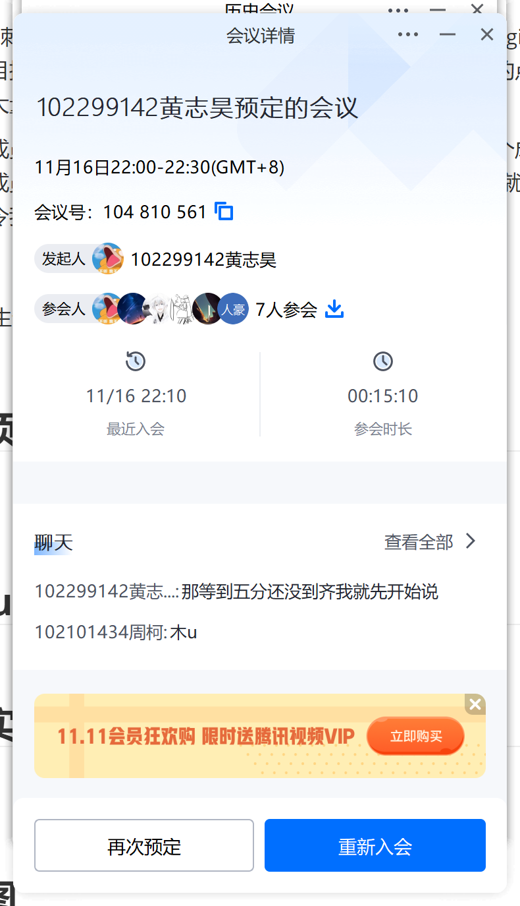

## 钉钉项目统计展示图表：

项目基本完成，只需再做稍许修缮：

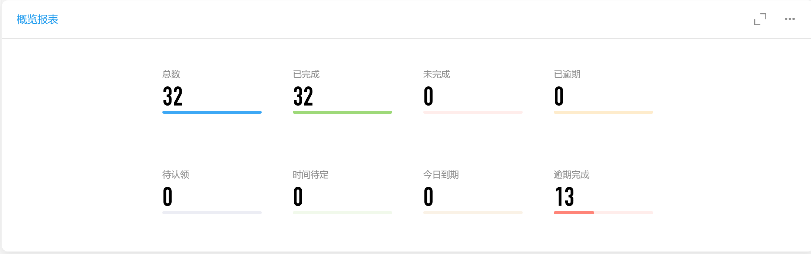

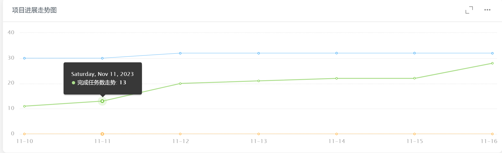

## GitHub签入记录

进行项目整合，完成大量内容：

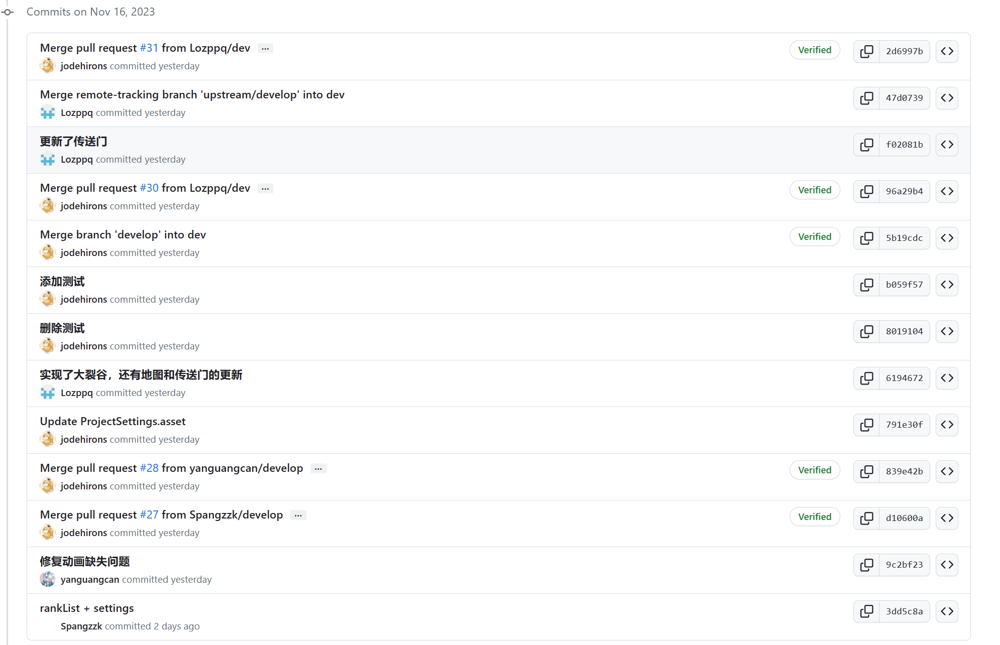

## 项目实现情况

游戏后台基本完成：

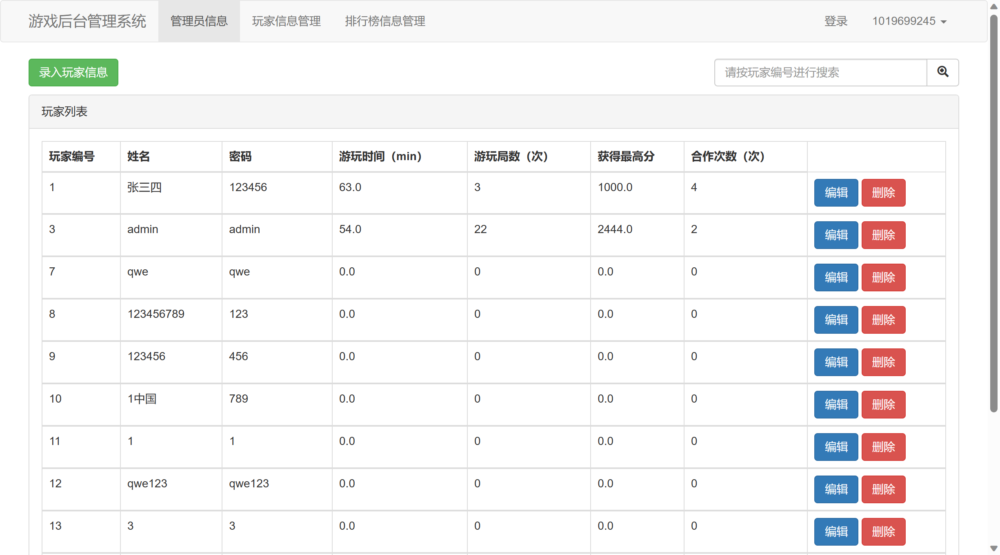

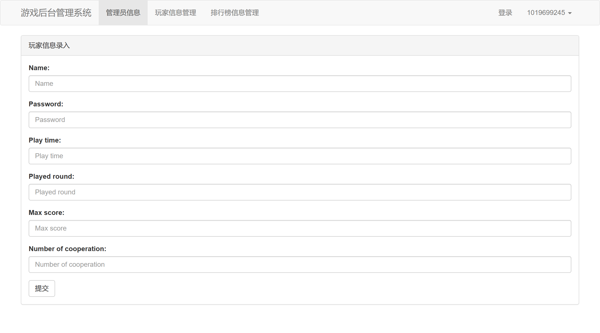

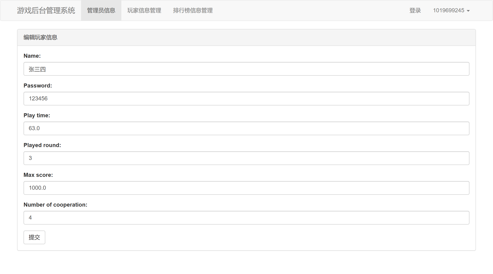

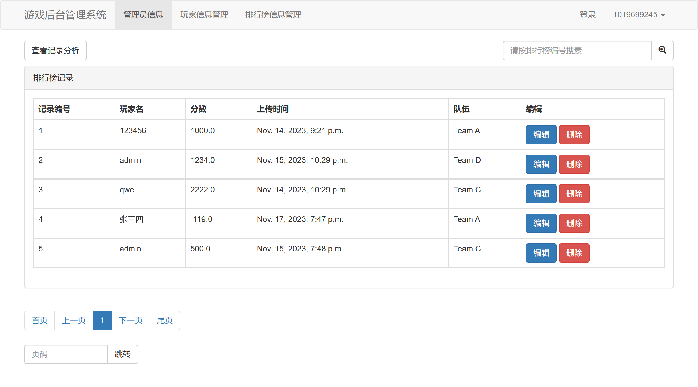

游戏主体实现传送门以及大裂谷：

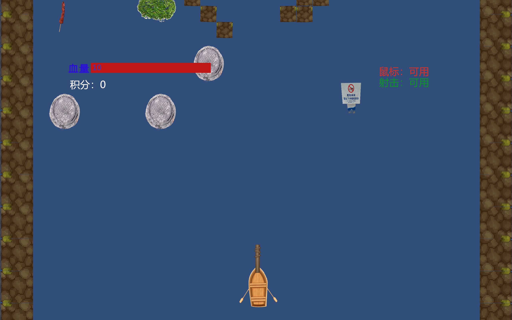

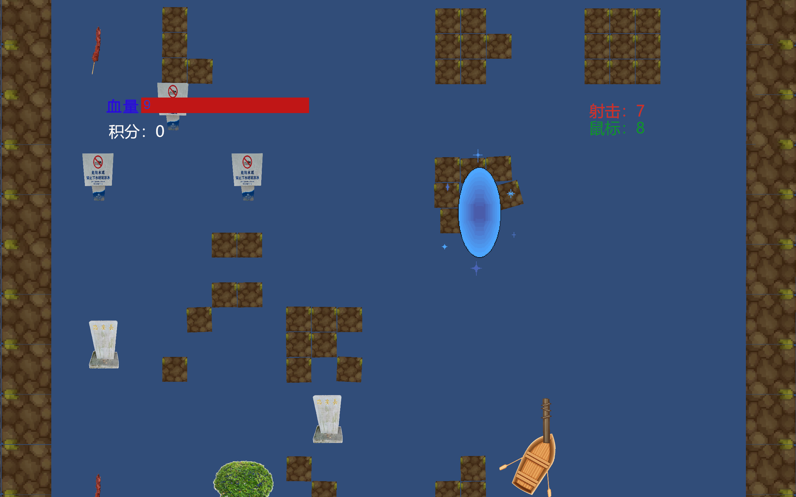

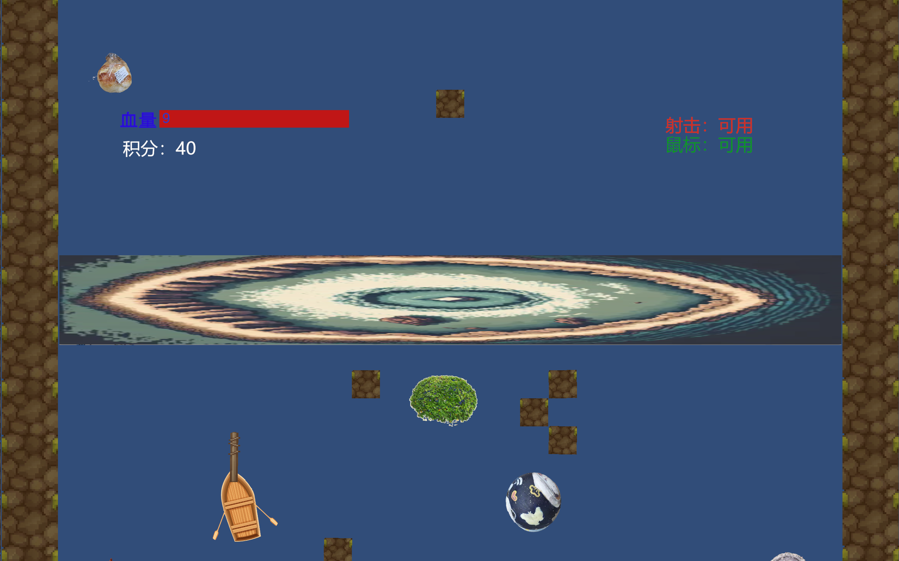

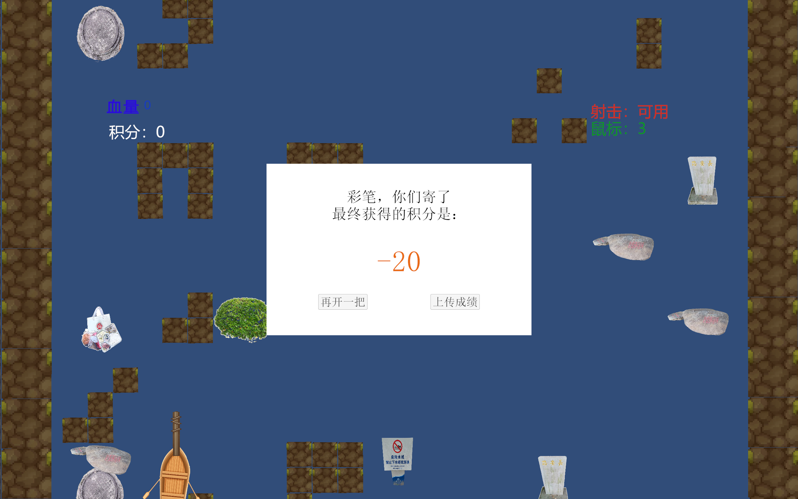

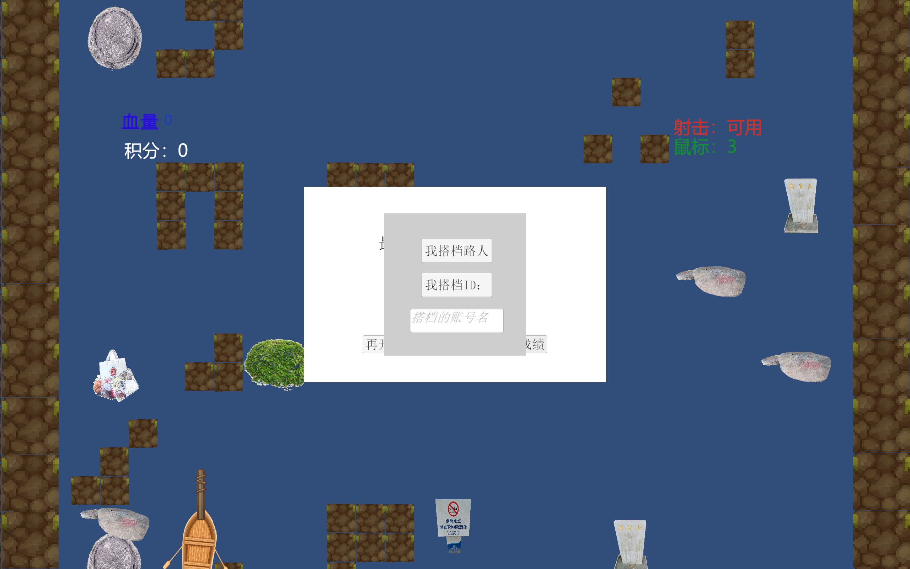

## 燃尽图

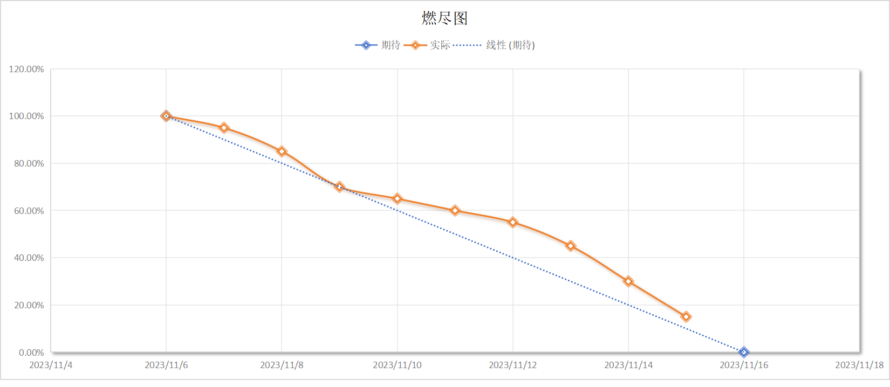

## 实现对应UML

实现游戏后台管理以及展示，实现游戏传送门以及大裂谷系统：

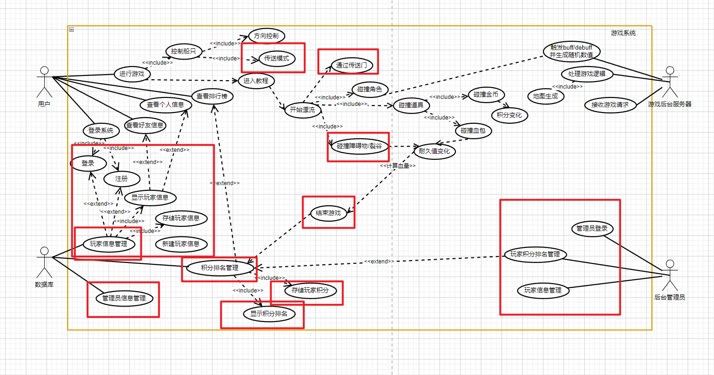

## 成员贡献

| 人员   | 完成任务                         | 贡献百分比 |
| ------ | -------------------------------- | ---------- |
| 卢泽强 | 实现传送门系统、实现大裂谷系统   | 19%        |
| 周柯   | 实现游戏上传成绩及对应排行榜系统 | 20%        |
| 汪伟杰 | 完成碰撞相关单元测试             | 14%        |
| 郑人豪 | 负责队员之间的交流和沟通         | 10%        |
| 郭巧婷 | 完成游戏动画系统                 | 12%        |
| 王君妍 | 尽力实现单元测试                 | 10%        |
| 黄志昊 | 完成游戏后台管理系统、撰写博客   | 14%        |