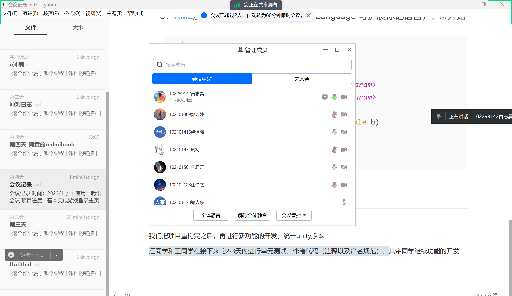
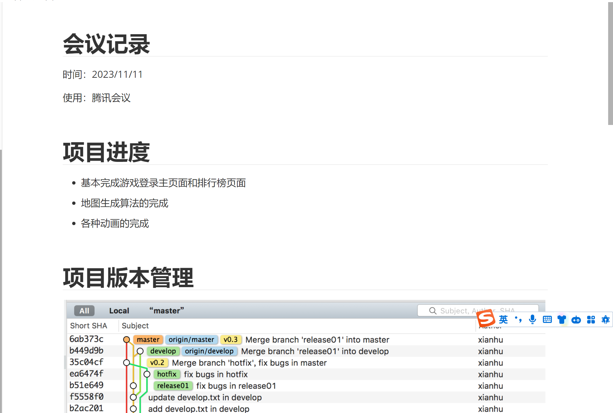
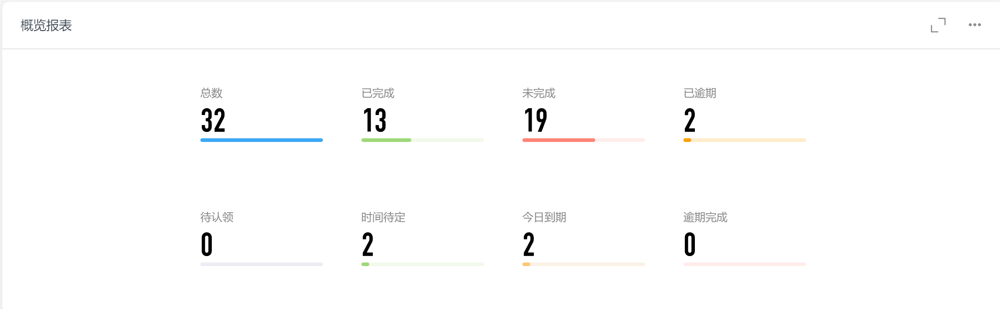
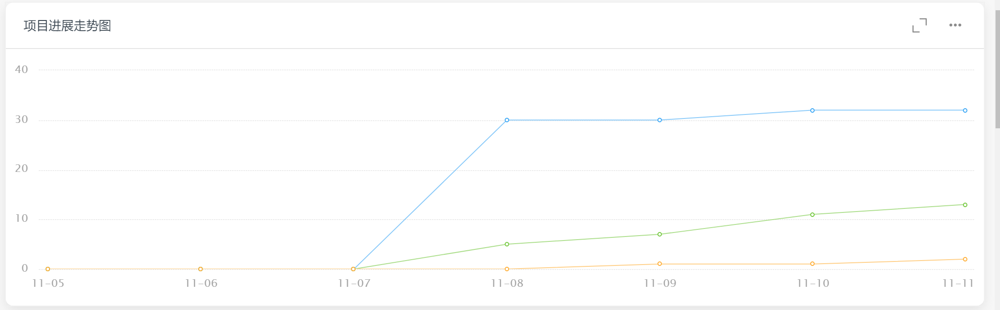
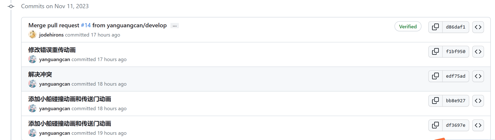
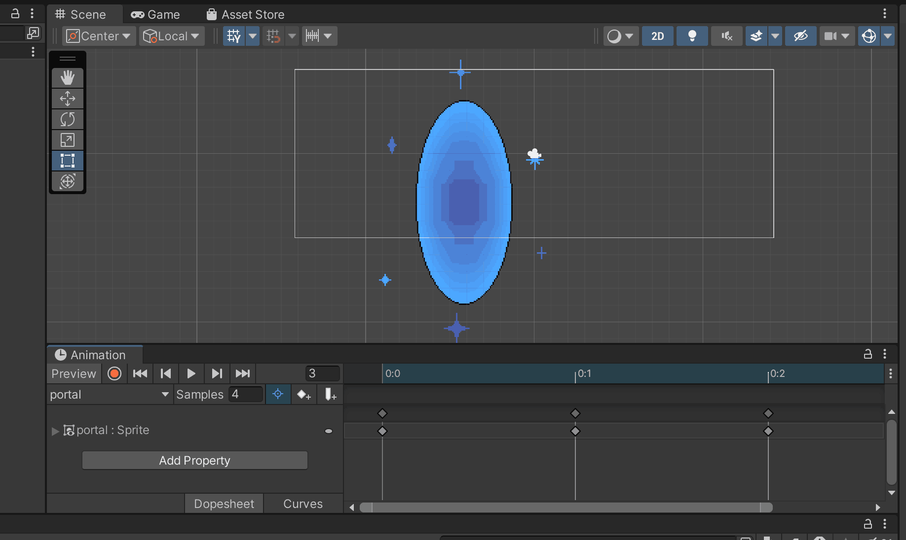
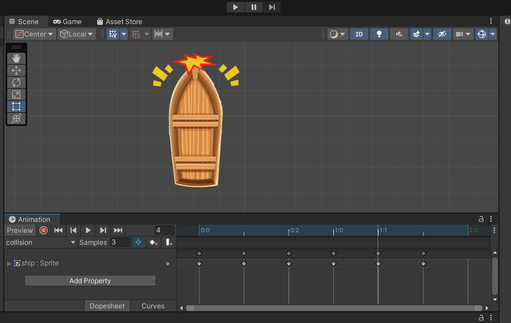
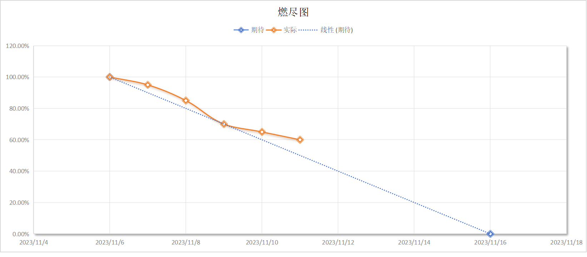
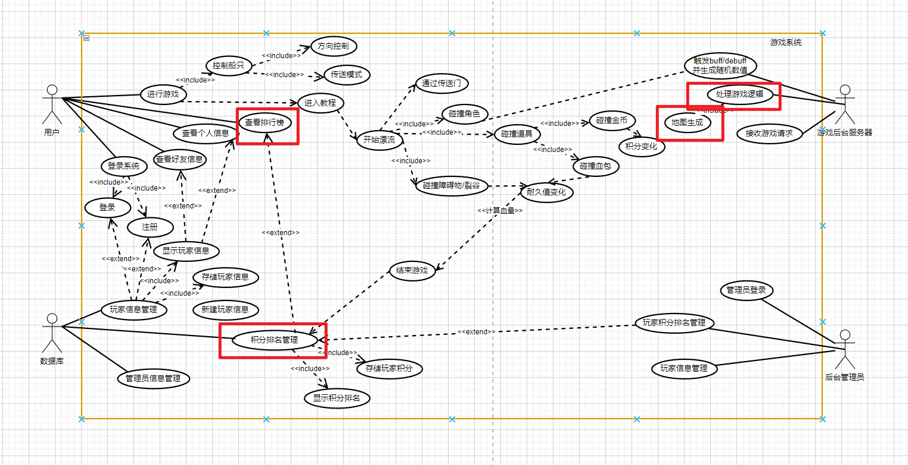

| 这个作业属于哪个课程 | [课程的链接](https://bbs.csdn.net/forums/fzusdn-0831?typeId=4994744) |
| -------------------- | ------------------------------------------------------------ |
| 这个作业要求在哪里   | [2023秋软工实践团队作业——alpha冲刺-CSDN社区](https://bbs.csdn.net/topics/617519084) |
| 作业目标             | 说明每日冲刺进度                                             |
| 团队名称             | ^o^☛我しΘνの軟件ユ徎(•̀ᴗ•́)و                                   |
| 参考文献             | Unity学习社区以及bilibili学习资料                            |

# 冲刺日志

## 项目进度追踪

| 人员   | 完成的任务                                         | 完成任务时长（h） | 剩余时间（h） | 完成任务遇到的问题                              | 处理的方式                                       |
| ------ | -------------------------------------------------- | ----------------- | ------------- | ----------------------------------------------- | ------------------------------------------------ |
| 卢泽强 | 优化地图生成算法和血条的显示                       | 6h                | 0h            | 地图生成的时候卡bug，血条动态显示不能很好的定位 | 利用Y轴进行板块生成地图，血条x轴根据大小重新定位 |
| 周柯   | unity降级重构与mysql链接调试                       | 2h                | 0h            | unity hub是\*\*\*，我也是***                    | csdn+gpt                                         |
| 汪伟杰 | 单元测试                                           | 2h                | 12h           | 单元测试有问题                                  | 查阅资料                                         |
| 郑人豪 | 音效触发模块的实现                                 | 3h                | 11h           | 触发音效的时机总是搞错                          | 查阅资料，观看相关视频                           |
| 郭巧婷 | 调整动画                                           | 2.5h              | 5h            | 误点了把上传记录关闭了，后来重传时有冲突        | 上网搜解决方法，把出错前备份的复制过去           |
| 王君妍 | 单元测试                                           | 2h                | 12h           | 缺乏单元测试的流程的概念                        | 查阅文字资料与视频资料                           |
| 黄志昊 | 发现项目问题，计划项目重构、测试项目导出、编写博客 | 4h                | 4h            | 项目中废文件太多，github上传下载太慢            | 重构项目，删除废文件、统一unity编辑器版本        |

## 今日会议

会议时间：2023/11/11

方式：腾讯会议

会议内容：

- 说明当前项目进度
- 提出当前项目问题：1、unity编辑器不统一；2、项目需要定期导出进行测试；3、项目代码撰写需要遵循规范
- 安排接下来的冲刺任务

会议过程：

会议内容截图：

## 钉钉项目统计展示图表：

## GitHub签入记录

添加内容：传送门动画

## 项目实现情况

今日项目完成度无太大推进，主要进行项目重构计划以及整合计划，删除项目内冗余数据、统一项目编辑器版本。

新加入传送门动画：

小船碰撞动画：

## 燃尽图

## 实现对应UML

继续推进与数据库的对接、完成相关子用例：

## 成员贡献

| 人员   | 完成任务                   | 贡献百分比 |
| ------ | -------------------------- | ---------- |
| 卢泽强 | 优化地图生成算法、显示血条 | 21%        |
| 周柯   | 优化前端数据库情况         | 20%        |
| 汪伟杰 | 研究单元测试、配置数据库   | 11%        |
| 郑人豪 | 研究触发音效               | 10%        |
| 郭巧婷 | 完成传送门动画             | 13%        |
| 王君妍 | 研究单元测试               | 10%        |
| 黄志昊 | 统筹项目，进行重构         | 15%        |