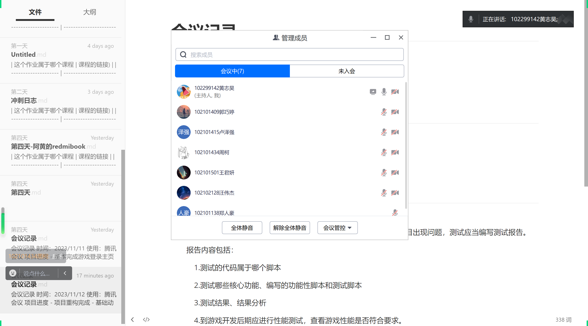
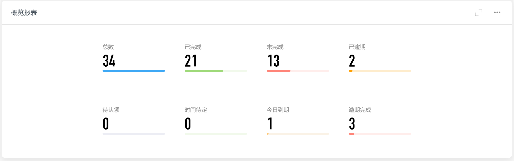
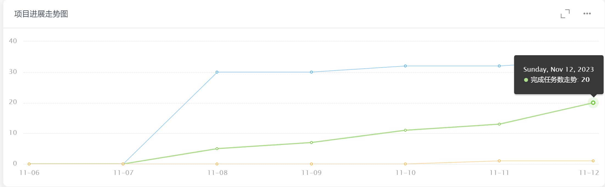
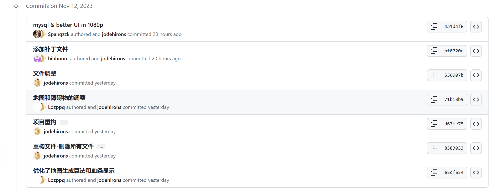
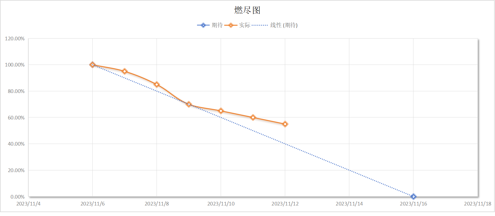

| 这个作业属于哪个课程 | [课程的链接](https://bbs.csdn.net/forums/fzusdn-0831?typeId=4994744) |
| -------------------- | ------------------------------------------------------------ |
| 这个作业要求在哪里   | [2023秋软工实践团队作业——alpha冲刺-CSDN社区](https://bbs.csdn.net/topics/617519084) |
| 作业目标             | 说明每日冲刺进度                                             |
| 团队名称             | ^o^☛我しΘνの軟件ユ徎(•̀ᴗ•́)و                                   |
| 参考文献             | Unity学习社区以及bilibili学习资料                            |

# 冲刺日志

## 项目进度追踪

| 人员   | 完成的任务                                 | 完成任务时长（h） | 剩余时间（h） | 完成任务遇到的问题                                           | 处理的方式                           |
| ------ | ------------------------------------------ | ----------------- | ------------- | ------------------------------------------------------------ | ------------------------------------ |
| 卢泽强 | 调整了地图的布局和障碍物的大小             | 4h                | 0h            | 地图太小，物体太大                                           | 重新调整地图的大小                   |
| 周柯   | mysql降级调整，ui重构，补充功能页面ui      | 4h                | 0h            | +10条语句de不掉一个bug，-1条语句bug干干净净                  | 李彦宏+黄总的玄学揣测+杰哥的精准处理 |
| 汪伟杰 | 修改了数据库，添加了动态链接库             | 2h                | 0h            | 数据库新表的问题                                             | 询问智慧勇敢多才优秀完美无瑕的队友   |
| 郑人豪 | 剪辑音频                                   | 2h                | 0h            | 无                                                           | 无                                   |
| 郭巧婷 | 绑定动画到对应角色物体上                   | 2h                | 3h            | pull时有错误没注意到以为pull完成了开始改代码，push时发现有冲突 | 查阅资料                             |
| 王君妍 | 重新拉取重构后代码并进行碰撞系统的相关检查 | 1.5h              | 0h            | 测试新的物理材料参数（取舍中）                               | 查阅文字资料与视频资料               |
| 黄志昊 | 开会分配任务、编写博客、统筹项目进度       | 3h                | 0h            | 项目导出成webgl时出现无法连接数据库的情况                    | 查阅相关资料                         |

## 今日会议

会议内容：

- 安排各组员任务
- 说明项目进展
- 进行项目测试安排

会议过程：

使用腾讯会议进行开会：

## 钉钉项目统计展示图表：

## GitHub签入记录

## 项目实现情况

本次主要是重新优化地图尺寸、优化登录界面尺寸、修复无法双人同时游玩的bug：

## 燃尽图

## 实现对应UML

今天冲刺主要是进行项目重构，统一unity版本，删除无用文件、优化项目实现，所以子用例并无更多实现，主要是优化地图大小，修改地图生成算法。

## 成员贡献

| 人员   | 完成任务                            | 贡献百分比 |
| ------ | ----------------------------------- | ---------- |
| 卢泽强 | 优化地图算法、修复无法双人游玩的bug | 20%        |
| 周柯   | 修复数据库bug，实现排行榜           | 20%        |
| 汪伟杰 | 修真数据库表格                      | 15%        |
| 郑人豪 | 修正游戏音效                        | 10%        |
| 郭巧婷 | 制作游戏动画                        | 10%        |
| 王君妍 | 进行碰撞系统优化                    | 10%        |
| 黄志昊 | 统筹项目安排，编写博客              | 15%        |