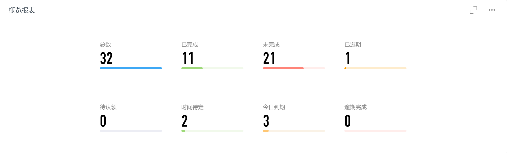
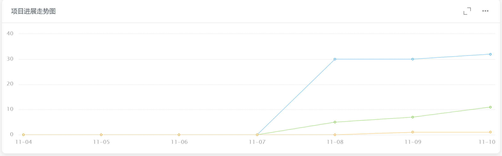
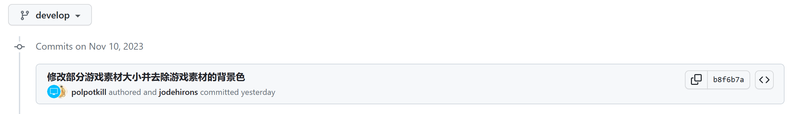
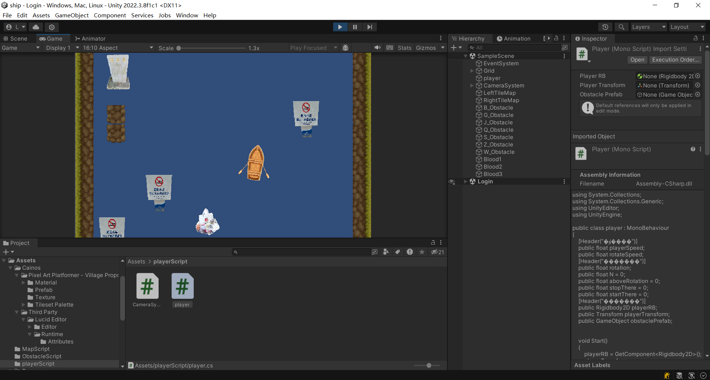

| 这个作业属于哪个课程 | [课程的链接](https://bbs.csdn.net/forums/fzusdn-0831?typeId=4994744) |
| -------------------- | ------------------------------------------------------------ |
| 这个作业要求在哪里   | [2023秋软工实践团队作业——alpha冲刺-CSDN社区](https://bbs.csdn.net/topics/617519084) |
| 作业目标             | 说明每日冲刺进度                                             |
| 团队名称             | ^o^☛我しΘνの軟件ユ徎(•̀ᴗ•́)و                                   |
| 参考文献             | Unity学习社区以及bilibili学习资料                            |

# 冲刺日志

## 项目进度追踪

| 人员   | 完成的任务                                          | 完成任务时长（h） | 剩余时间（h） | 完成任务遇到的问题                                         | 处理的方式                               |
| ------ | --------------------------------------------------- | ----------------- | ------------- | ---------------------------------------------------------- | ---------------------------------------- |
| 卢泽强 | 修改了地图的无限生成算法，还有素材的插入            | 9h                | 0h            | 生成的地图不丝滑，不够合理                                 | 使用板块生成，每隔一定的距离生成一个版块 |
| 周柯   | 音乐按钮功能实现&排行榜ui                           | 7h                | 0h            | 不会实现窗口滚动                                           | bilibili大学+deeeeeeeeeeebug             |
| 汪伟杰 | 完善数据库，测试是否能导出                          | 3h                | 2h            | 导出有问题跟导入的dll有关                                  | 查阅质料                                 |
| 郑人豪 | 学习unity中音效触发模块的实现                       | 4h                | 0h            | 不会设置音效的触发时机                                     | 查找相关资料                             |
| 郭巧婷 | 制作传送门动画和调整游戏素材                        | 4h                | 0h            | 不会粒子效果                                               | 查找资料和视频                           |
| 王君妍 | 学习素材使用、渲染器使用、C#入门                    | 2.5h              | 0h            | 优化过程可能需要通过以上功能实现效果                       | 查阅文字资料与视频资料                   |
| 黄志昊 | 进行整个unity项目导出的测试，研究导出异常、撰写博客 | 3h                | 3h            | 项目导出exe会出现分辨率问题，项目导出为webgl会出现大量错误 | 查阅unity说明文档及相关资料              |

## 今日会议

​	今日无会议，大家按照之前的安排继续作业。

## 钉钉项目统计展示图表：

## GitHub签入记录

前台客户端仓库：

后台游戏仓库：

## 项目实现情况

​	项目已经实现前台游戏和数据库的连接、前台排行榜模板的实现：

​	游戏进一步优化地图生成算法：

​	初步实现传送门动画：

## 燃尽图

## 实现对应UML

​	根据实际情况进一步优化用例图，在处理游戏逻辑下添加“地图生成”子用例。

​	今天主要完成查看排行榜、积分排名管理、处理游戏逻辑和地图生成用例。

## 成员贡献

| 人员   | 完成任务                         | 贡献百分比 |
| ------ | -------------------------------- | ---------- |
| 卢泽强 | 无线生成地图算法                 | 20%        |
| 周柯   | 前端排行榜界面                   | 19%        |
| 汪伟杰 | 数据库功能完善                   | 15%        |
| 郑人豪 | 音乐触发初步实现                 | 10%        |
| 郭巧婷 | 传送门动画初步实现               | 12%        |
| 王君妍 | unity知识的学习                  | 9%         |
| 黄志昊 | 项目导出测试、项目统筹、博客撰写 | 15%        |