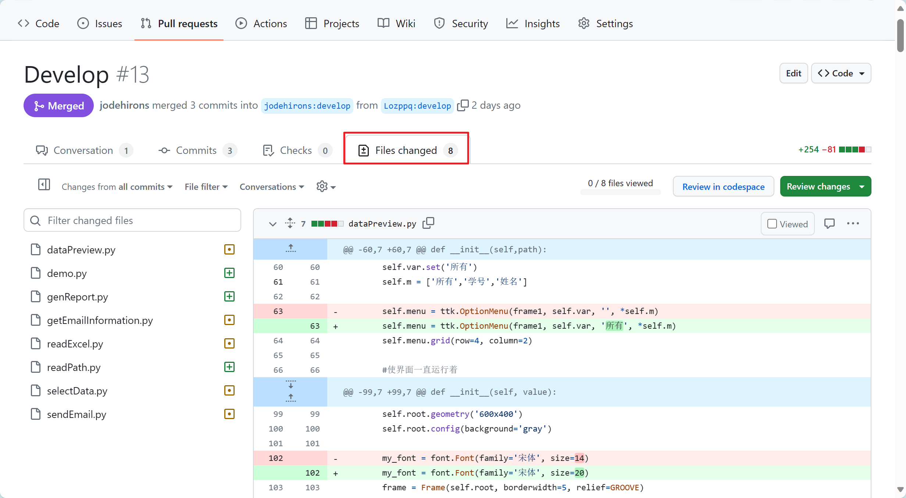

| 这个作业属于哪个课程 | [课程的链接]([2023秋-福州大学软件工程社区-CSDN社区云](https://bbs.csdn.net/forums/fzusdn-0831?typeId=4994744)) |
| -------------------- | ------------------------------------------------------------ |
| 这个作业要求在哪里   | [2023秋软工实践团队作业——alpha冲刺-CSDN社区](https://bbs.csdn.net/topics/617519084) |
| 作业目标             | 1、总结先前课程工作 2、安排冲刺计划                |
| 团队名称             | ^o^☛我しΘνの軟件ユ徎(•̀ᴗ•́)و                                   |

·

# 工作总结与思考

## 阶段成就

- 在先前的项目工作中，我们完成了对于游戏整体的需求分析，对游戏的框架进行了UML设计，并完成了一个简要的游戏demo。
- 游戏的基本设计以及需求分析较为完善，并且在开题答辩阶段也取得了相对较高的成绩，各类图表绘制完善，功能设计较为明确，已经不需要对整体的框架进行大的变动，应在α冲刺过程中实现需求分析报告所述内容，并进一步的修改与完善。
- 游戏的前后端原型完善得囊括了游戏的基本框架，无需更多的修改只需想办法实现即可。

## 出现问题

  1、在先前合作过程中出现的最严重的问题就是：团队的成员对于Github使用不熟练，不熟悉相关工作流程，不了解团队分工合作的工作顺序，甚至出现在一次pull request的过程中，推送成员没有及时跟上团队的版本、同时负责审核的本人也没有细看，直接同意了其pull request的请求，导致仓库版本错乱，更新内容被覆盖，又浪费了诸多时间去修复。

  2、第二有待解决的问题就是团队成员之间互相交流不充分，因为各团队成员都有各自的作业、竞赛之类的项目，难以统一线下合作时间，所以之前的项目大都以线上分工汇总的形式进行，所以各同学撰写代码习惯各有不同，代码风格不一致，致使最后汇总的时候花费了大量的时间进行对接与修改，这方面又浪费了大量的时间。

## 解决方案

  1、针对Github团队合作的问题，一方面让团队成员继续研读教程，另一方面修改Github仓库审核批准机制，将几名同学设为管理员，同时设置每一次的pull request需要有相对数量的管理员进行审批同意之后，才能由项目负责人同意并入仓库之中，避免出现版本错乱，覆盖文件的问题。

  2、针对团队交流的问题，应当把握这次校运会以及第八周以后课程渐少的时机，抓住大家都有时间的时候进行线下合作，提升交流以及团队效率，尽快完成项目的开发。

# 团队分工

  按照之前的游戏设计，以验收标准中的基础标准为α冲刺的要求（即排除掉联机部分），可将游戏设计分为以下模块：

- 地图模块
- 小船主体模块
- 游戏素材模块
- 数据库对接模块

我们按照需要完成的模块进行分工

|成员|负责工作|
|--|----|
|黄志昊|整体项目的负责，各部分统筹兼顾、游戏后台管理系统的实现|
|周柯|协助整体游戏玩法的实现、关卡设计等|
|卢泽强|小船主体模块的负责、整体游戏玩法的实现|
|王君妍|游戏地图中碰撞系统、物理系统、事件触发算法、实现以及优化|
|郭巧婷|游戏动画系统的负责、美术素材的负责，实现游戏中各类动画|
|郑人豪|游戏中音效及相关触发的实现、游戏模块的测试、各类开发的协助|
|汪伟杰|游戏碰撞系统的优化、地图生成算法的实现以及优化、数据库的实现和对接|

# 冲刺计划

对接下来十天的冲刺拟定如下的冲刺计划：

|时间|任务安排|
|--|----|
|11月8日-11月9日|游戏主体Ui界面的设计|
|11月10日-11月12日（校运会期间）|完成游戏游玩部分主体内容：1、基本动画系统（划船动画、传送门射击以及传送门动画）；2、碰撞系统；3、传送门功能实现|
|11月13日|组装以上单元模块进行测试|
|11月14日-15日|实现地图生成算法、进行关卡设计，实现肉鸽系统|
|11月16日|实现后台数据库、进行数据库对接，整体组装、测试、优化|
|11月17日|制作vlog、PPT汇报、游戏再优化|

# 项目仓库

游戏仓库链接：[jodehirons/Unity\_game\_bowing: unity双人合作划船游戏 (github.com)](https://github.com/jodehirons/Unity_game_bowing)

前台客户端页面仓库：https://github.com/Spangzzk/demo_window

后台管理客户端仓库：[jodehirons/background (github.com)](https://github.com/jodehirons/background)

  

